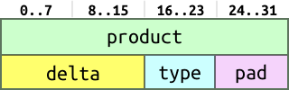

section: ARM,Efficient C for ARM
title: Padding
icon: rocket
date: 2012-03-03
layout: page
tags: ARM, EfficientC, Slide, BasicOptimisation
pageOrder: 2110
next: hoisting
previous: bitfields
----

%% Slide

## Padding

Structures often end up containing *padding*.

* Required because of target’s data type restrictions.
  * e.g. ARM keeps `int`s on a 32-bit boundary.

Easy to waste memory if you’re not aware of where padding is inserted.

Solution:

* Sort elements in the structure by size:
  * Place elements in small-to-large or large-to-small order.
  * This minimises the amount of padding.

The compiler cannot perform this transformation itself as the C standard guarantees that structure members will be laid out in the order that they’re specified.

%% Examples

## Example

Consider the structure:

``` c
struct
{
  unsigned char type;
  int           product;
  short         delta;
}
```

It is laid out in memory like this:


But if we sort the structure members by size, largest to smallest:

``` c
struct
{
  int           product;
  short         delta;
  unsigned char type;
}
```



The padding can be removed and the structure reduces by four bytes (a third).
