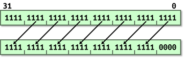
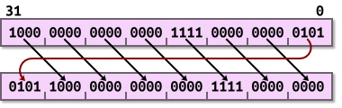
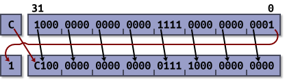

section: ARM,Introduction to ARM
title: Barrel Shifter
icon: compass
date: 2012-03-03
tags: ARM,IntroductionToARM,Slide
layout: page
pageOrder: 1120
next: operand2
previous: compare
----

%% Slide
  
## Barrel Shifter

The *barrel shifter* is a functional unit which can be used in a number of different circumstances. It provides five types of shifts and rotates which can be applied to Operand2. (These are not operations themselves in ARM mode.)

## `LSL` – Logical Shift Left

Example: Logical Shift Left by 4.

Equivalent to `<<` in C.

## `LSR` – Logical Shift Right

Example: Logical Shift Right by 4.

Equivalent to `>>` in C. i.e. unsigned division by a power of 2.

## `ASR` – Arithmetic Shift Right

Example: Arithmetic Shift Right by 4, positive value.

Example: Arithmetic Shift Right by 4, negative value.

Equivalent to `>>` in C. i.e. signed division by a power of 2.

## `ROR` – Rotate Right

Example: Rotate Right by 4.

Bit rotate with wrap-around.	

## `RRX` – Rotate Right Extended

Example: Rotate Right Extended.

33-bit rotate with wrap-around through carry bit.
  
%% Examples
  
## Examples

* `MOV r0, r0, LSL #1`
  * Multiply R0 by two.
* `MOV r1, r1, LSR #2`
  * Divide R1 by four (unsigned).
* `MOV r2, r2, ASR #2`
  * Divide R2 by four (signed).
* `MOV r3, r3, ROR #16`
  * Swap the top and bottom halves of R3.
* `ADD r4, r4, r4, LSL #4`
  * Multiply R4 by 17. (N = N + N * 16)
* `RSB r5, r5, r5, LSL #5`
  * Multiply R5 by 31. (N = N * 32 - N)

%% Remarks
  
## Remarks

At the start I mentioned that certain C operations don’t map onto available CPU operations. `ROR` and `RRX` are two of those operations.

Certain ARM instructions such as `MUL`, `CLZ` and `QADD` cannot use the barrel shifter.

Note that right shifting negative signed quantities is strictly *implementation defined* behaviour in C. The compiler is allowed to choose whether it performs a logical or an arithmetic shift. (That said, it’s always implemented as an arithmetic shift in all of the ARM toolchains the author has used.)
