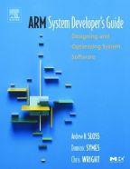
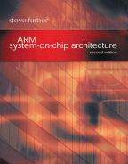
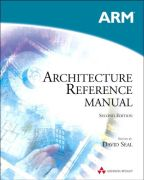
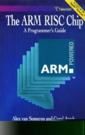

section: arm
title: Introduction to ARM: Books
icon: compass
date: 2012-03-03
tags: ARM,IntroductionToARM,Slide
layout: page
pageOrder: 1430
previous: arm-test
----

%% Slide
  
## Books

There are a number of printed ARM books available. Below is a list of the books I’ve encountered with some notes about how they stack up today in 2012.

## ARM System Developer’s Guide
* by Andrew Sloss, Dominic Symes and Chris Wright
* Morgan Kaufmann
* ISBN 1558608745
* Published May 2004
* 
* This is the single best book about writing software for ARM processors. It covers ARM, Thumb, efficient C programming, optimising ARM assembly, optimised primitives, digital signal processing, exception and interrupt handling, firmware, caches, MPUs and MMUs. It details ARM and Thumb instructions up to ARMv6 and lists cycle timings for a variety of cores up to and including the ARM11.

## ARM System-on-Chip Architecture (2nd ed.)
* by Steve Furber
* Addison-Wesley
* ISBN 0201675196
* Published Aug 2000
* 
* Written by one of the principal creators of the ARM this, as the name indicates, looks at ARM processors from an architectural point of view. It covers the history of the architecture and describes multiple different implementations of the architecture from the ARM7TDMI up to ARM10.
* A great book. One particular pleasing aspect is the number of high-quality diagrams. However it is over a decade old now. The chips it discusses are quite dated. That said as you’d expect its fundamentals are as sound as ever.

## ARM Architecture Reference Manual (2nd ed.)
* by David Seal
* Addison-Wesley
* ISBN 0201737191
* Published Dec 2000
* 
* This is the bible for the ARM architecture. Not exactly a sit-down read but as a reference manual we trawl the ARM ARM when we need to know the exact behaviour of an instruction.
* The printed book is expensive and superseded by versions freely available from ARM Ltd.’s website (you may need to register for the latest ARM ARM which covers ARMv7). Only buy this if you can find a copy for a sensible price or you object to reading PDFs on-screen.
* The edition shown is equivalent to the revision ‘E’ ARM ARM, which covers up to ARMv5T.

## The ARM RISC Chip: A Programmer’s Guide
* by Alex van Someren and Carol Atack
* Addison-Wesley
* ISBN 0201624109
* Published Oct 1993
* 
* Nearly 20 years old, grab this and blow off the dust only if you need a historical perspective on the ARM6 family cores used in the Newton MessagePad.
