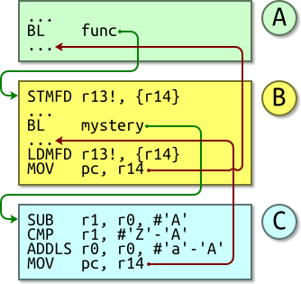

section: ARM,Introduction to ARM
title: A Call Chain
icon: microchip
date: 2012-03-03
tags: ARM,IntroductionToARM,Slide
pageOrder: 1220
next: task-one
previous: stack
----

%% Slide
  
## A Call Chain

1. Routine A branches with link (`BL`) to routine B.
  * This saves its return address, the address of the next instruction, into R14 and then jumps to the routine B’s first instruction.
2. Routine B is going to call another subroutine, routine C.
  * Were it to immediately call routine C using `BL` then its existing stored R14 would be overwritten. So it stores its R14 to the stack to preserve it.
3. It `BL`’s to routine C. (R14 ← return address, PC ← Routine C).
4. Routine C does its work, then returns using `MOV pc,r14`.
  * Its return value is passed back in R0. R1 is corrupted. (R0..R3 are allowed to be corrupted in AAPCS).
5. We return to Routine B after the `BL` instruction.
6. It restores R14 from the stack.
7. A return is effected and we end up at the instruction after the original `BL`.

Routine C does not call any subroutines; it is known as a *leaf* routine. Leaf routines can dispense with the overhead of storing their return address on the stack.
