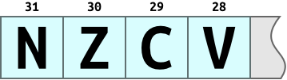

section: arm
title: Introduction to ARM: Conditional Execution
icon: compass
date: 2012-03-03
tags: ARM,IntroductionToARM,Slide
layout: page
pageOrder: 1160
next: multiply
previous: branch
----

%% Slide
  
## Conditional Execution

A beneficial feature of the ARM architecture is that instructions can be made to execute conditionally. This is common in other architectures’ branch or jump instructions but ARM allows its use with most mnemonics.

The condition is specified with a two-letter suffix, such as `EQ` or `CC`, appended to the mnemonic. The condition is tested against the current processor flags and if not met the instruction is treated as a no-op. This feature often removes the need to branch, avoiding pipeline stalls and increasing speed. It can also increase code density.

By default the data processing instructions do not affect the condition code flags but can be made to by suffixing `S`. The comparison instructions `CMP`, `TST`, and co. do this implicitly.

%% Examples
  
## Examples

The following code fragment is a loop which runs until the counter in R1 hits zero, at which point the condition code `NE` (not equal to zero) controlling the branch becomes false.

``` arm
	MOV   r1, #10
loop
	...
	SUBS  r1, r1, #1
	BNE   loop
```
  

%% Slide
  
## Flags

The top end of the program status register looks like this:



When an ALU operation changes the flags:

* N – Negative
  * is set if the result of a data processing instruction was negative.
* Z – Zero
  * is set if the result was zero.
* C – Carry
  * is set if an addition, subtraction or compare causes a result bigger than 32 bits, or is set from the output of the shifter for move and logical instructions.
* V – Overflow
  * is set if an addition, subtraction or compare produces a signed result bigger than 31 bits.

## Condition Codes

Code | Suffix  | Description                         | Flags
-----|---------|-------------------------------------|-------
0000 | EQ      | Equal / equals zero                 | Z
0001 | NE      | Not equal                           | !Z
0010 | CS / HS | Carry set / unsigned higher or same | C
0011 | CC / LO | Carry clear / unsigned lower        | !C
0100 | MI      | Minus / negative                    | N
0101 | PL      | Plus / positive or zero             | !N
0110 | VS      | Overflow                            | V
0111 | VC      | No overflow                         | !V
1000 | HI      | Unsigned higher                     | C and !Z
1001 | LS      | Unsigned lower or same              | !C or Z
1010 | GE      | Signed greater than or equal        | N == V
1011 | LT      | Signed less than                    | N != V
1100 | GT      | Signed greater than                 | !Z && (N == V)
1111 | LE      | Signed less than or equal           | Z || (N != V)
1110 | AL      | Always (default)                    | any
  
%% Remarks
  
## Remarks

The (omitted from slide) `NV` condition code is deprecated. Though it originally provided an analogue for the `AL` condition code, it was more useful to recover the 2<sup>24</sup> instructions its presence consumed.

%% Examples
  
## Examples

Use a sequence of several conditional instructions:

``` arm
    CMP   r0, #5   ; if (a == 5)
    MOVEQ r0, #10  ;
    BLEQ  fn       ;   fn(10)
```

(Assume `a` is in R0. Compare R0 to 5. The next two instructions will be
executed only if the compare returns EQual. They move 10 into R0, then call
‘`fn`’ (branch with link, `BL`).)

Set the flags, then use various condition codes:

``` arm
    CMP   r0, #0   ; if (x < 0)
    MOVLE r0, #0   ;   x = 0;
    MOVGT r0, #1   ; else x = 1;
```

Use conditional compare instructions:

``` arm
    CMP   r0, #'A' ; if (c == 'A'
    CMPNE r0, #'B' ;  || c == 'B')
    MOVEQ r1, #1   ;   y = 1;
```

A sequence which doesn’t use conditional execution:

``` arm
    CMP   r3, #0
    BEQ   next
    ADD   r0, r0, r1
    SUB   r0, r0, r2
next
...
```

By transforming the sequence with conditional execution an instruction can be
removed:

``` arm
    CMP   r3, #0
    ADDNE r0, r0, r1
    SUBNE r0, r0, r2
    ...
```

%% Remarks
  
## Remarks

Some of the newer instructions such as `PLD` or `BLX` can’t be conditionally executed. These are encoded using the instruction space occupied by the now-obsolete `NV` (never execute) condition code.

It’s possible to combine the `S` bit with conditional execution, e.g. `ADDEQS r0, r1, r2`.

The only compiler which makes extensive use of condition codes is ARMCC. It applies them in an optimisation pass called branch removal.

When is it worth branching over condition codes? Depends on the CPU’s branch penalty, but it’s often 4..6 instructions.
