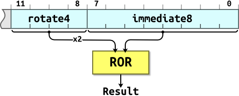

section: ARM,Introduction to ARM
title: Immediate Values
icon: microchip
date: 2012-03-03
tags: ARM,IntroductionToARM,Slide
pageOrder: 1140
next: branch
previous: operand2
----

%% Slide
  
## Immediate Values

* You can’t fit an arbitrary 32-bit value into a 32-bit instruction word.
* ARM data processing instructions have 12 bits of space for values in their instruction word. This is arranged as a four-bit rotate value and an eight-bit immediate value:



The 4-bit rotate value stored in bits 11-8 is multiplied by two giving a range of 0-30 in steps of two.

Using this scheme we can express immediate constants such as:

* `0x000000FF`
* `0x00000FF0`
* `0xFF000000`
* `0xF000000F`

But immediate constants such as:

* `0x000001FE`
* `0xF000F000`
* `0x55550000`

...are not possible.

An assembler will convert big values to the rotated form. Impossible values will cause an error.

Some assemblers will use other tricks such as using `MVN` instead of `MOV` to form the bitwise complement of the required constant. For example the impossible instruction `MOV r0,#0xFFFFFFFF` could be assembled as `MVN r0,#0`.

%% Remarks
  
## Remarks

The impact of this is that some constants are “ARM friendly”. Some are not. Study of the numbers you’re using can sometimes reveal scope for [optimisation](../efficient-c-for-arm/biasing.html).

%% Slide
  
## Loading Wide Values

You can form constants wider than those available in a single instruction by using a sequence of instructions to build up the constant. For example:

``` arm
MOV r2, #0x55           ; R2 = 0x00000055
ORR r2, r2, r2, LSL #8  ; R2 = 0x00005555
ORR r2, r2, r2, LSL #16 ; R2 = 0x55555555
```

...or load the value from memory:

``` arm
LDR r2, =0x55555555
```

The pseudo-instruction `LDR Rx,=const` tries to form the constant in a single instruction, if possible, otherwise it will generate an `LDR`.
