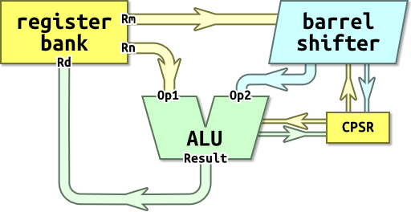

section: ARM,Introduction to ARM
title: Organisation
icon: compass
date: 2012-03-03
tags: ARM,IntroductionToARM,Slide
layout: page
pageOrder: 1070
next: movement
previous: syntax
----

%% Slide
  
## Organisation

ARM has a three-address format:

* `Rd` — destination register
* `Rn` — source register
* `Rm` — source register

e.g. `ADD R0,R1,R2`.

`Rn` is used directly but `Rm` is passed through the *barrel shifter*; a functional unit which can rotate and shift values. The result of this is called *Operand2*.

The two operands are processed by the ALU and the result written to `Rd`.
  
%% Remarks
  
## Remarks

Although it’s a register, we show the CPSR separately on the diagram to indicate that it may be used in both the barrel shifter and the ALU stages.
