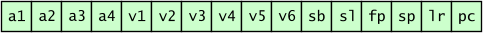
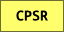

section: ARM,Introduction to ARM
title: Registers
icon: microchip
date: 2012-03-03
tags: ARM,IntroductionToARM,Slide
layout: page
pageOrder: 1040
next: pc
previous: instruction-sets
----

%% Slide

## Registers

ARM has sixteen registers visible at any one time. They are named R0 to R15. All are 32 bits wide.

The registers may also be referred to by the following aliases:

All of the registers are general purpose, save for:

* R13 / SP
  * which holds the *stack pointer*.
* R14 / LR
  * the link register which holds the callers’s return address.
* R15 / PC
  * which holds the *program counter*.

In addition to the main registers there is also a status register:

CPSR is the *current program status register*. This holds flags: results of arithmetic and logical operations.

%% Remarks

## Remarks

This slide shows the *user mode* register set.

Register aliases are subject to the current calling convention. The ones shown here are apply to AAPCS – the ARM standard calling convention.

Strictly R13 is used for the stack pointer by convention, rather than a rule, in ARM mode. In Thumb mode it is more hardwired.

%% Slide

## Load-Store Architecture

ARM is a *load-store architecture*:

* You must load values into registers in order to operate upon them.
* No instructions directly operate on values in memory.
