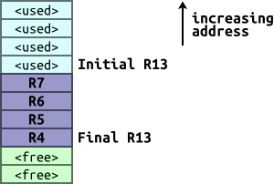

section: ARM,Introduction to ARM
title: The Stack
icon: compass
date: 2012-03-03
tags: ARM,IntroductionToARM,Slide
layout: page
pageOrder: 1210
next: chain
previous: multiple-data-transfer
----

%% Slide
  
## The Stack

We need to store the processor state when making nested calls.

The multiple data transfer instructions provide a mechanism for storing state on the *stack* (pointed to by R13).

The `STM` and `LDM` instructions’ modes have aliases for accessing stacks:

* `FD` = Full Descending
  * `STMFD`/`LDMFD` = `STMDB`/`LDMIA`
* `ED` = Empty Descending
  * `STMED`/`LDMED` = `STMDA`/`LDMIB`
* `FA` =  Full Ascending
  * `STMFA`/`LDMFA` = `STMIB`/`LDMDA`
* `EA` =  Empty Ascending
  * `STMEA`/`LDMEA` = `STMIA`/`LDMDB`

Anything but a full descending stack is rare!
  
%% Examples
  
## Examples

`STMFD r13!, {r4-r7}` – Push R4,R5,R6 and R7 onto the stack.

`LDMFD r13!, {r4-r7}` – Pop R4,R5,R6 and R7 from the stack.

