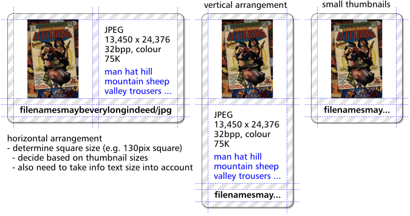

title: PrivateEye 3.00 with a couple of fixes
icon: search
date: 2017-02-08
tags: RISC OS, PrivateEye
----

<!-- begin summary -->

An update to my RISC OS image viewer [PrivateEye](/risc.os/privateeye.html) is now available with a couple of small but essential fixes for anyone using a Raspberry Pi 3, or using a version of RISC OS with zero page protection enabled:

* It avoids crashes on the Raspberry Pi 3 by fixing a previously undetected `MOVS pc` instruction. It appears that the Cortex-A53 faults these instructions; a change from earlier cores.
* There was a `NULL` dereference in the choices handling code when the user clicked on a pane containing hidden choices (those without a UI). This would cause a crash on zero page protected OSes.

Additionally it was rebuilt using the latest [DDE27 tools](https://www.riscosopen.org/content/sales/dde) from RISC OS Open Ltd.

<!-- end summary -->

##### Regarding the grand version number...

In my mind PrivateEye 3.00 _was_ intended to be a big old beast of a release featuring a triad of enhancements to make sorting and searching through images a breeze:

1. _Tag Cloud_ – would let you label images and search for images using labels arranged in a Filer-like [tag cloud](https://en.wikipedia.org/wiki/Tag_cloud).
2. _Thumbview_ – was intended to be like a souped-up [PhotoFiler](/risc.os/photofiler.html) displaying larger thumbnails, image dimensions and labels from tag cloud.
3. _Canvas_ - was to be a multiple-image viewer window which would let you plonk images down side-by-side for comparison.

... but there was insufficient time and inclination to get this stuff finished.

Here's a sketch from the Thumbview prototyping stages showing the sort of thumbnails planned:

Even though they're compiled out you'll find evidence of these features in PrivateEye 3.00 in the greyed-out options in Choices dialogue and in the Messages and the Sprites files. These features have were never finished so are disabled in this release. Although they do work to varying extents.

If you're sufficiently intrigued by the Tag Cloud idea then you can play with the [Tag Cloud test application](../software/tagcloud001.zip).

