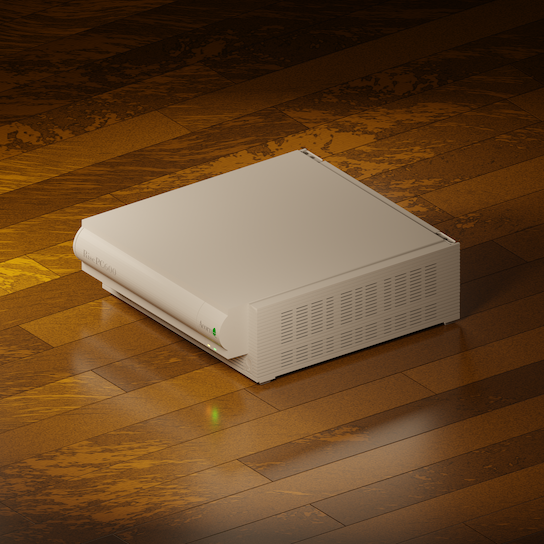

title: A Virtual Risc PC
icon: pencil-alt
date: 2019-11-01
tags: Project, Acorn, Risc PC, Doodle, Blender, 3D
----

<!-- begin summary -->

I've been learning how to model 3D objects in [Blender](https://www.blender.org/) by recreating the Acorn Risc PC case.

[Read about it here.](../doodles/blendrpc.html)

<!-- end summary -->
