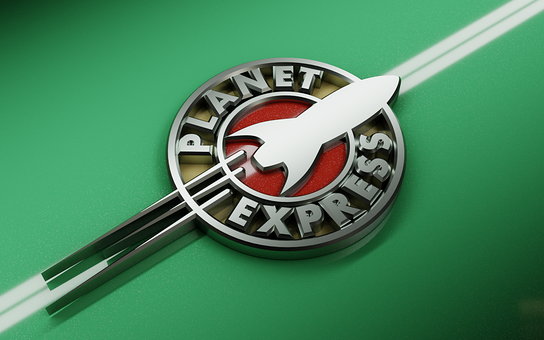

title: Logos!
icon: pencil-alt
date: 2022-07-22
tags: Blog, Doodle, 3D, Blender
----

<!-- begin summary -->

My rendering addiction continues. I've made another batch of backdrops in [Blender](https://www.blender.org/). This time I'm having a go at some logos. We've got the Half-Life 2 logo, the Planet Express logo from Futurama and a not-the-usual Atari logo.

[Click here for tasty logo goodness](../doodles/logos.html).

I've also updated the [Cogs](../doodles/cogs.html) and [Nuts](../doodles/nuts.html) pages:

* Cogs gains a "Super Cog" piece
* Nuts gains "Electron", "BBC Owl" and "Archimedes" pieces

_Good day to you sir_

<!-- end summary -->
