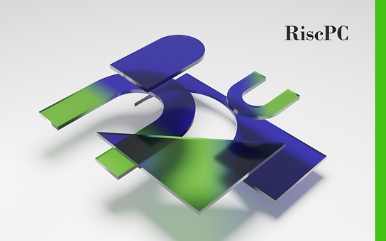

title: Risc PC logo
icon: pencil-alt
date: 2022-09-11
tags: Blog, Doodle, 3D, Blender
----

<!-- begin summary -->

I've recreated the [original plexiglass-in-mid-air Risc PC logo](https://chrisacorns.computinghistory.org.uk/docs/Acorn/Brochures/Acorn_APP678_RiscPC600.pdf):

Grab a copy over here on the [Nuts](../doodles/nuts.html) page.

<!-- end summary -->
