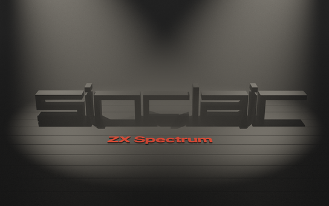
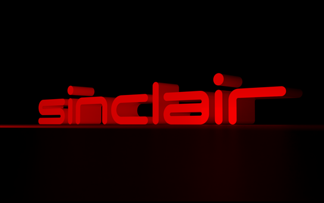
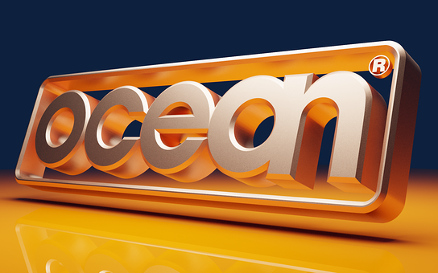

title: New logo renders
icon: pencil-alt
date: 2022-11-20
tags: Doodle, 3D, Blender
----

<!-- begin summary -->

I've made a few new logo recreation reinterpretation renderisations:

If you're bothered, the downloads are over on the [logos](../doodles/logos.html) page.

<!-- end summary -->
