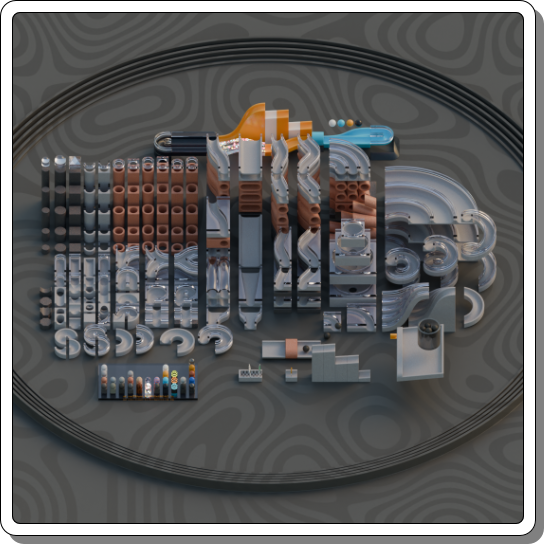

title: A Marble Run Kit for Blender
icon: circle
date: 2024-05-18
tags: Blog, Project, Blender, 3D
----

<!-- begin summary -->

I've made a kit of parts in [Blender](https://www.blender.org/) for building marble runs.

There are over two hundred types of track to try out, including slides, ramps, tunnels, spirals, splits and bends. I've also built and included variously coloured terrazzo, granite, metallic and transparent materials for a classy looking track.

It's designed around a basic block size of 4x4x2cm allowing a 2.5cm marble size.

A little demo scene is included.

It's free - Enjoy! Get it from https://dpt.itch.io/marble-kit

<!-- end summary -->
