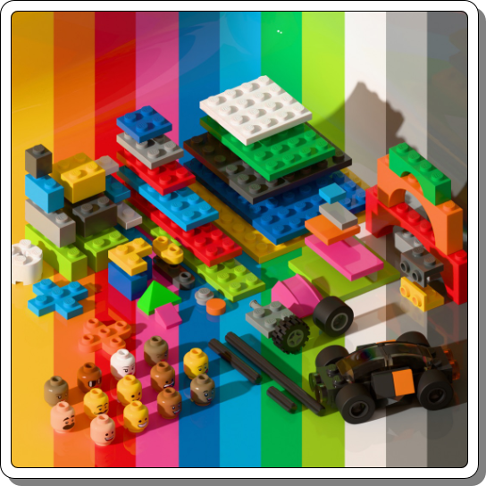

title: A LEGO Kit for Blender
icon: cube
date: 2025-05-17
tags: Blog, Project, Blender, 3D, LEGO
----

<!-- begin summary -->

I've followed up the [Marble Run Kit](/blog/20240518-marble-run-kit.html) by making reasonably accurate recreations of some LEGO bricks in [Blender](https://www.blender.org/).

The pieces are constructed using quads. This enables subdivision surfaces to be applied allowing for very high resolution results.

It's free - Enjoy! Get it from https://dpt.itch.io/lego-kit

<!-- end summary -->

### Scripts

Two scripts are included in the file:

- "Nine Tile Expander" installs on the N-panel in a "DPT" tab. Run it to take a collection of nine tiles and expand them out. Use this to quickly build new pieces (nine tiles for plates included).
- "Sync Mesh Names" installs in the same tab. Run it to synchronise all mesh names with their parent objects. 

### Disclaimer

This file is provided for personal, non-commercial, use. It is not sponsored or authorised by the LEGO Group.
