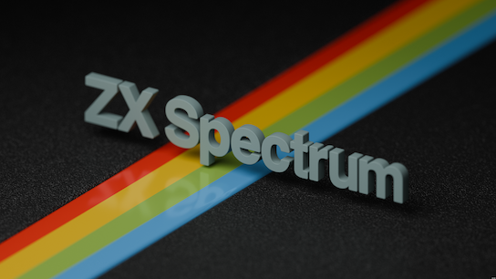
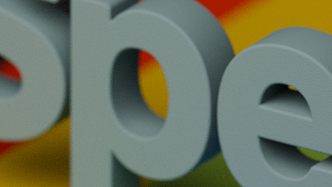

title: "ZX Spectrum Stripes" Render
icon: pencil-alt
date: 2025-06-28
tags: Blog, Doodle, 3D, Blender, Sinclair, Spectrum
----

<!-- begin summary -->

This new render is Sinclair ZX Spectrum inspired. Not of a Speccy itself but instead of the lettering and rainbow stripe. The lettering is presented in squidgy rubber grey, hovering over the rainbow stripe set as if a 48K+ or 128K toastrack case.

This time it's a huge 4K (3840x2160) render. Click for the huge version.

_tata Spec-chums!_

[More logo renders here](../doodles/logos.html).

<!-- end summary -->
