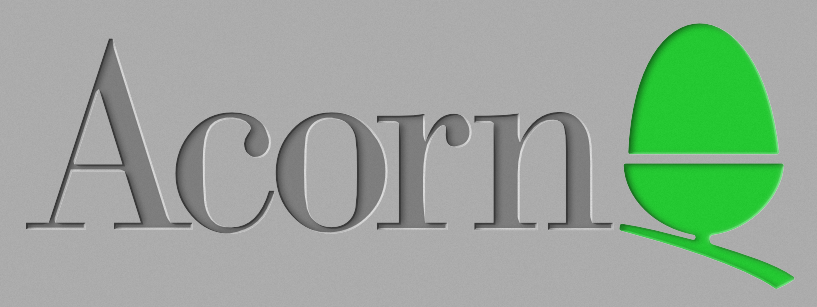
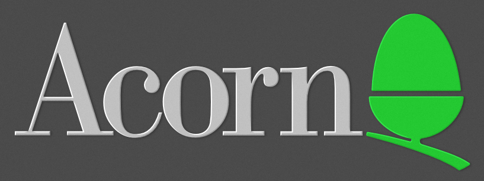

section: Doodles
title: Acorn logo
subtitle: the Acorn company logo
icon: pencil-alt
date: 2020-11-26
tags: Doodle, Trace
pageOrder: 1040
----

I've taken the vector Acorn Computers logo that I made for my [Risc PC recreation in Blender](blendrpc.html) and have drawn profiles around the edges, creating a chamfered edge style, producing this nice engraved look:

I originally did the same some years ago using Xara Designer Pro, but I've ignored that version here, rebuilding it in Affinity Designer, which offers more expressive stroke profiles. If you have Affinity and are sufficiently motivated you can grab that version and twiddle the colours to create embossed variants instead.

Note that the grey shades are not pure, they have a 10% noise effect.

I've added a version tuned for 800x600 Archimedes modes too.

### Update, December 2020

Here's a variation which is embossed rather than engraved:

## Downloads

* [Engraved PNG format wallpaper @ 1920x1200](acorn/acorn-chamfered.1920x1200.png)
* [Engraved PNG format wallpaper @ 800x600 Archimedes 256 colour palette](acorn/acorn-chamfered.800x600.arc.png)
* [Engraved - Affinity Designer source](acorn/acorn-chamfered.afdesign)
* [Embossed PNG format wallpaper @ 1920x1200](acorn/acorn-chamfered-out.1920x1200.png)
* [Embossed PNG format wallpaper @ 800x600 Archimedes 256 colour palette](acorn/acorn-chamfered-out.800x600.arc.png)
* [Embossed - Affinity Designer source](acorn/acorn-chamfered-out.afdesign)
