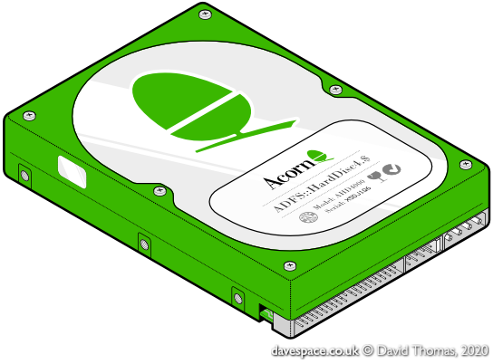
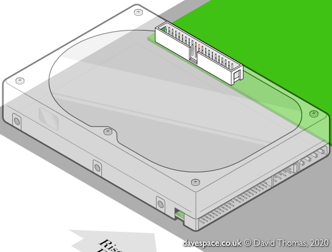
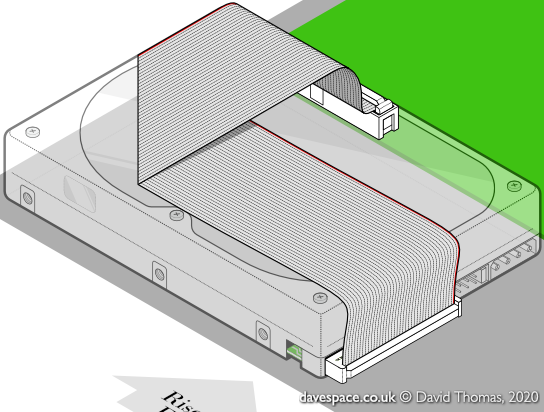

section: Doodles
title: An Anachronistic Hard Disc
subtitle: drawn in Affinity Designer
icon: pencil-alt
date: 2020-03-25
tags: Doodle, Acorn, Hard Disc, 2D, Isometric, Vector
pageOrder: 1030
----

## What if Acorn had supplied on-brand green hard discs?

Perhaps then the diagram in the user guide would look something like this:

Like most perfectly normal people, I've always enjoyed a good diagram. So in an attempt to learn or mimic the style I drew this hard disc in [Affinity Designer](https://affinity.serif.com/en-gb/designer/) using its isometric mode.

In November 2020 I reworked it slightly: The tracks on PCB are a bit wider, more like the real thing, the saturation is increased to make it pop, and the label is reworked slightly.

## Adding an IDE Cable

Continuing the experiment I decided to attempt a diagram that shows the correct installation of an Acorn Risc PC IDE cable. The IDE cable in a Risc PC is non-standard, compared to PC types, and requires a fold for the hard disc cable to reach the main board's IDE socket.

The ghost hard disc lets us see through to the IDE socket to the Risc PC main board:

And then with the cable installed:

## Huge Ones

Download: [Green hard disc, PNG format @ 4096 pixels wide](acornhdd.v6.png)  
Download: [IDE cable disconnected, PNG format @ 4096 pixels wide](acornhddcable-out.png)  
Download: [IDE cable connected, PNG format @ 4096 pixels wide](acornhddcable-in.png)

