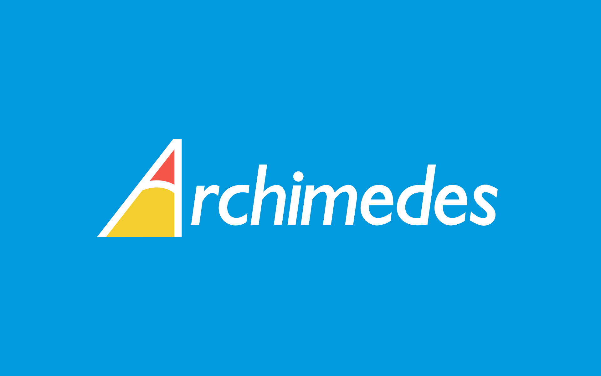
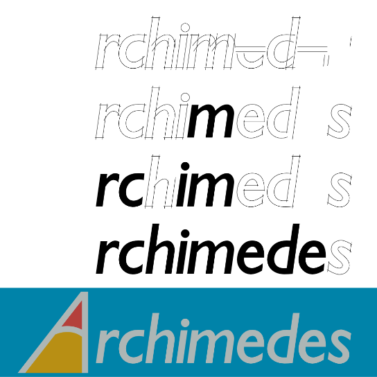

section: Doodles
title: Acorn Archimedes logo
subtitle: from Acorn's Archimedes range of computers
icon: pencil-alt
date: 2019-09-14
tags: Doodle, Trace, Archimedes, Logo, Recreation
pageOrder: 1010
----

## Second attempt - 2024

My first attempt at drawing this logo (see below) used a respaced and slightly modified Gill Sans as the main text. In restrospect it looked a bit too light. Also the "i" and the "m" were a bit too close together in the result. In this version I've redrawn the whole logo from scratch.

### Downloads

* [PNG](archimedes/archimedes-again.png)
* [PDF](archimedes/archimedes-again.pdf)
* [SVG](archimedes/archimedes-again.svg)

### License

This graphic, <a rel="cc:attributionURL" property="dct:title" href="http://www.davespace.co.uk/doodles/archimedes.html">Archimedes Computer Logo Recreation 2</a> by <a rel="cc:attributionURL dct:creator" property="cc:attributionName" href="http://www.davespace.co.uk/">David Piero Thomas</a>, is licensed under <a rel="license" href="https://creativecommons.org/licenses/by-sa/4.0?ref=chooser-v1" target="_blank" rel="license noopener noreferrer" style="display:inline-block;">Attribution-ShareAlike 4.0 International</a> <i class="fab fa-creative-commons"></i><i class="fab fa-creative-commons-by"></i><i class="fab fa-creative-commons-sa"></i>.

You are free to share and adapt it, even commercially, but you must give appropriate credit and indicate if changes were made, and you must distribute your contributions under the same license.

## First attempt - 2019

I have recreated the logo from Acorn's Archimedes range of computers:

I traced this from a scan of the original and matched the fonts. The original seems to have marginally thicker letterforms (although that perhaps could be an artefact of the printing process) and a slightly different slope on the end of the 'r'. It's a pretty good match otherwise.

Why do this? To make custom mouse mats of course!

### Downloads

* [PDF](archimedes/archimedes.pdf)
* [SVG](archimedes/archimedes.svg)
* [PNG @ 1920x1200 with shadow effect](archimedes/archimedes.1920x1200.png)
* [PNG @ 1920x1200 with shadow+emboss effect](archimedes/archimedes.1920x1200.3d.png)

### License

This graphic, <a rel="cc:attributionURL" property="dct:title" href="http://www.davespace.co.uk/doodles/archimedes.html">Archimedes Computer Logo Recreation</a> by <a rel="cc:attributionURL dct:creator" property="cc:attributionName" href="http://www.davespace.co.uk/">David Piero Thomas</a>, is licensed under <a rel="license" href="https://creativecommons.org/licenses/by-sa/4.0?ref=chooser-v1" target="_blank" rel="license noopener noreferrer" style="display:inline-block;">Attribution-ShareAlike 4.0 International</a> <i class="fab fa-creative-commons"></i><i class="fab fa-creative-commons-by"></i><i class="fab fa-creative-commons-sa"></i>.

You are free to share and adapt it, even commercially, but you must give appropriate credit and indicate if changes were made, and you must distribute your contributions under the same license.

