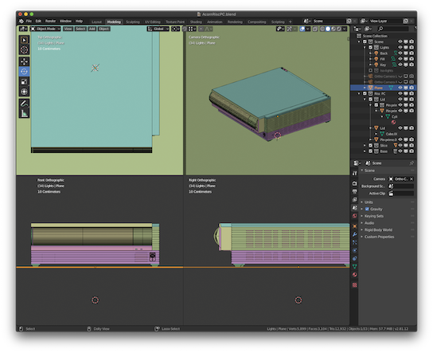
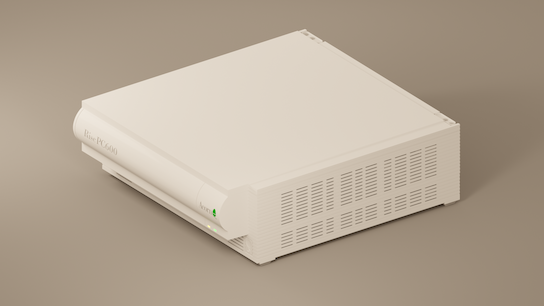
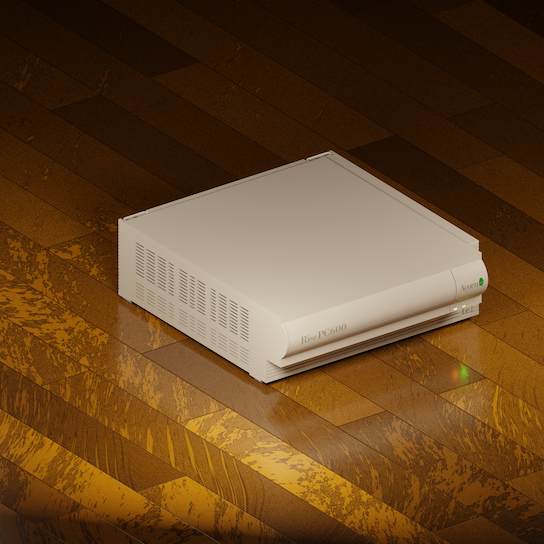
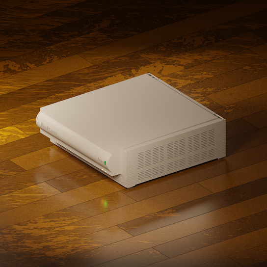
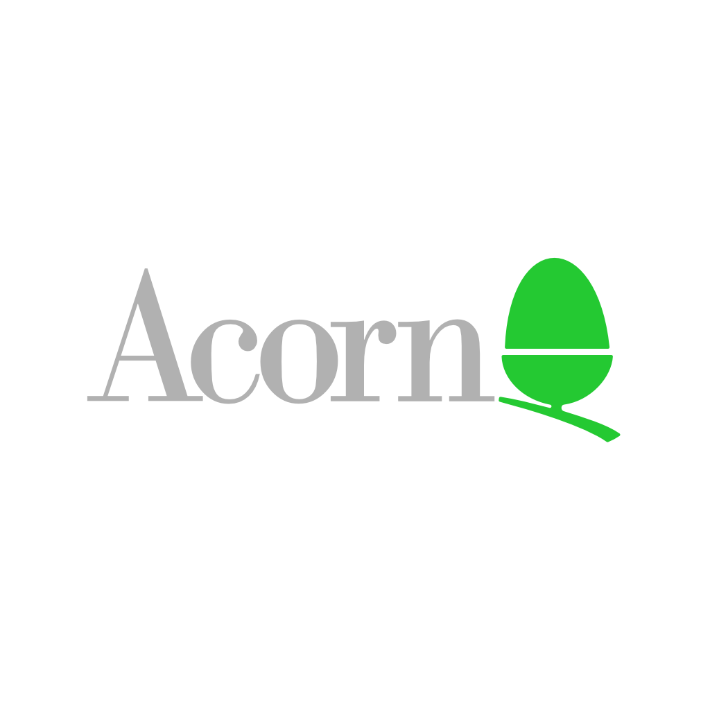
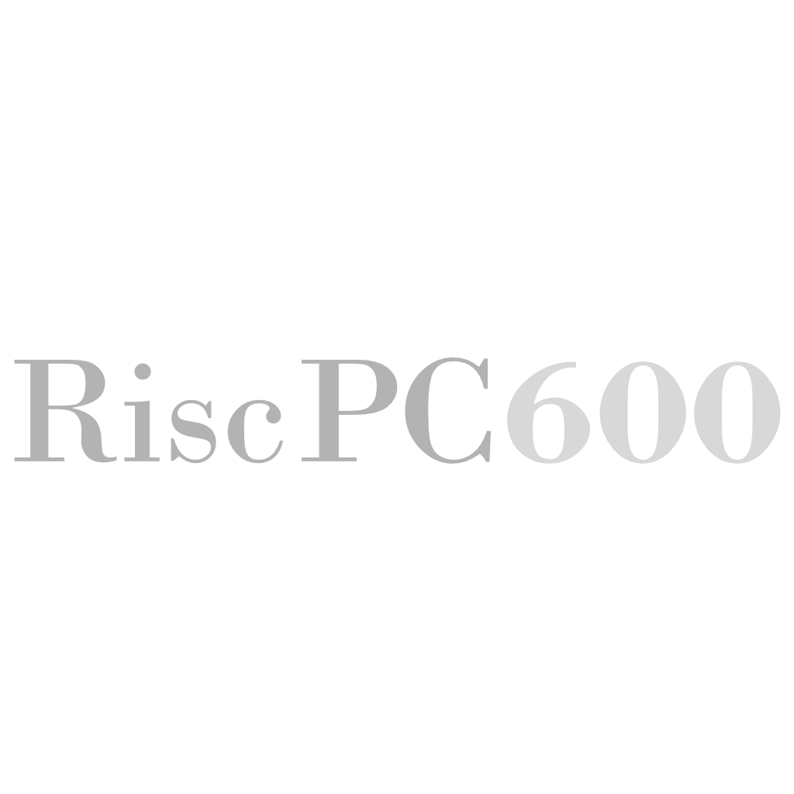
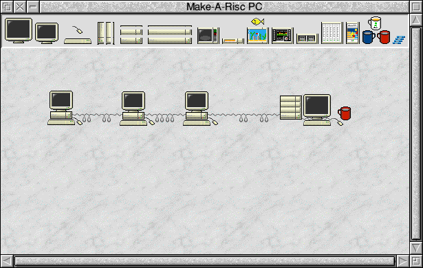

section: Doodles
title: Acorn Risc PC 3D model
subtitle: drawn in Blender
icon: pencil-alt
date: 2019-11-01
tags: Doodle, 3D, Blender
pageOrder: 1020
----

This is an accurate 3D model of an Acorn Risc PC 600 computer case. It was drawn in [Blender](https://www.blender.org/) during my current attempts to learn 3D modelling, inspired by the wonderful art of [Guillaume Kurkdjian](http://guillaumekurkdjian.com/).

<a>Screenshot of editing the model in Blender.</a>

It was measured from the real thing down to the millimetre so it's very accurate. But if for some reason you were compelled to try to 3D print it you'd soon find it's not nearly realistic enough, e.g. the back of the case is just blank and the edges are too sharp.

#### Renders

The main use is in rendering pretty pictures like these:

<a>This is the first rendering I was pleased with.</a>

<a>A brighter rendering with less gloss - and no more levitation.</a>

<a>The current version has this high-gloss wooden effect floor (left hand view).</a>

<a>Right hand view.</a>

#### Logos

To get the rendering of the Acorn logo and the "Risc PC 600" type on the front panels looking super sharp I recreated them in vector format using Affinity Designer.

Acorn's standard typeface was Bodoni and the best matching implementation of that I've found is [Bodoni MT](https://docs.microsoft.com/en-us/typography/font-list/bodoni-mt). However it's not _quite_ the same. And then when I started critiquing other versions of the Acorn logo I began driving myself nutty (Acorn joke there) and seeing other differences. In any case, it's a pretty close approximation of the true Acorn logo.

I then turned them into the following 1024 pixel square textures for use on the model:

<a>The recreated Acorn logo.</a>

<a>The recreated Risc PC 600 type.</a>

#### History

In some ways this is a return to my 1995 Make-A-Risc PC app:

#### Changes

* 6th June 2020 - Replaced the orange marble effect floor with a wooden effect floor based on [this tutorial](https://www.youtube.com/watch?v=XKSkqc5szeQ).

#### Downloads

* [Blender 3D Model (2MB)](blendrpc/blendrpc.wood.blend)
* [Orange backdrop style render in PNG format @ 2048x2048 pixels - left hand view (3MB)](blendrpc/blendrpc.wood.2k.left.png)
* [Orange backdrop style render in PNG format @ 2048x2048 pixels - right hand view (3MB)](blendrpc/blendrpc.wood.2k.right.png)

#### Thanks

Thanks to Frank Bullen for the loan of his Risc PC.

