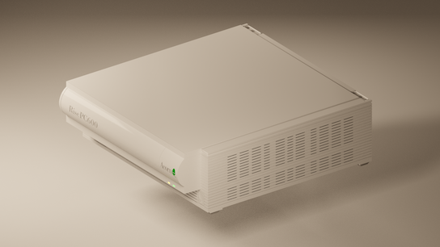
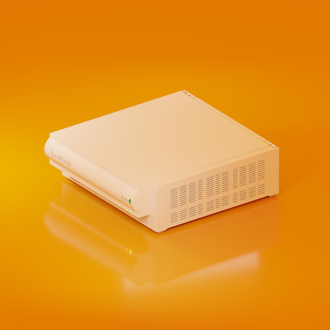
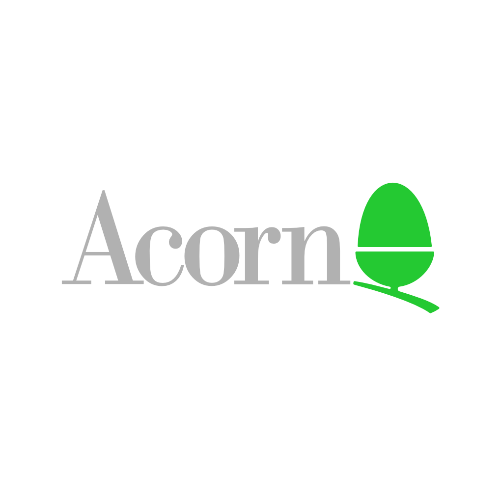

section: Doodles
title: Acorn Risc PC 3D model
subtitle: drawn in Blender
icon: pencil-alt
date: 2019-11-01
tags: Doodle, 3D, Blender
pageOrder: 1020
----

This is a detailed 3D model of the case of an Acorn Risc PC 600 computer, drawn in [Blender](https://www.blender.org/) during an attempt to learn 3D modelling. It was measured from the real thing down to the millimetre, so it looks very accurate (but if for some reason you tried to 3D print it you'd soon find it's not nearly realistic enough, e.g. the back of the case is just blank).

The main use is in rendering pretty pictures like these:

<a>This is the first render I was pleased with.</a>

<a>A brighter rendering with less gloss - and no more levitation.</a>

<a>The current version has this orange backdrop - although note that this particular model had a hole in the back.</a>

To get the front panels right I recreated the original logos as vectors, then turned them into 1024x1024 textures:

<a>Acorn logo</a>

<a>Risc PC 600 type</a>

Download:
[Blender 3D Model](blendrpc.blend) |
[PNG @ 2048x2048 (3MB)](blendrpc.2048.png)

