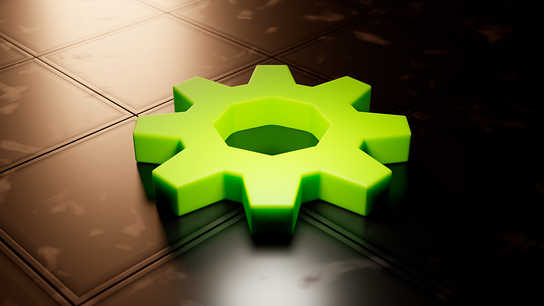
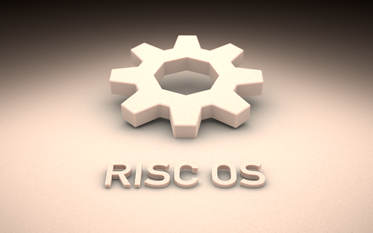
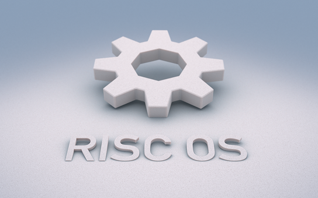
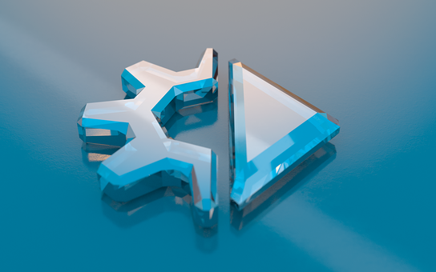
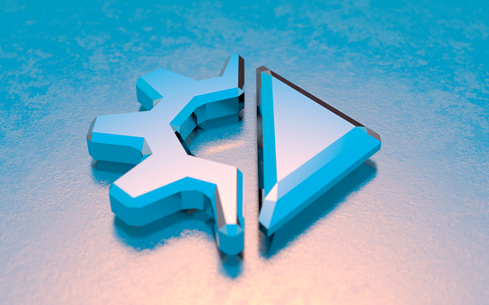
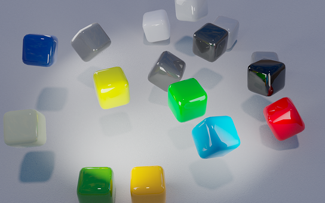
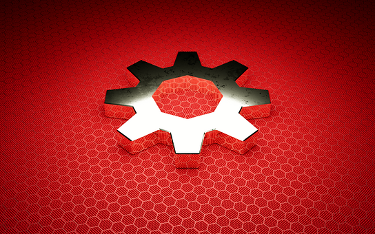

section: Doodles
title: Rendered Cogs
subtitle: backdrops
icon: pencil-alt
date: 2022-06-17
tags: Doodle, 3D, Blender
pageOrder: 1080
----

Here are some RISC OS themed backdrops (and animations) made in [Blender](https://www.blender.org/).

Click for **big** 1920x1200 PNG format versions (rendered for sRGB colour space).

<a>A resin cog on a, err, dirty floor.</a>

<a>A shinier set of cogs on a (now clean) floor.</a>

<a>Snow cog.</a>

<a>Polystyrene cog with "RISC OS".</a>

<a>Polystyrene cog with "RISC OS", try 2.</a>

<a>Cut glass RISC OS Direct logo, on glass.</a>

<a>Silver RISC OS Direct logo, on metal.</a>

<a>Car paint cog basks in sunset.</a>

<a>Desktop palette cubes having a bounce around.</a>

<a>Silver cog.</a>

<a>Super cog.</a>

## Animated

<a>A rotating cog. The above image is an animated PNG (APNG). Click for an MP4 version with a chequered background.</a>

## License, Trademarks & Credits

The images are free for personal use. For any commercial use, customisations or commissions please contact me.

The [RISC OS Cog](http://www.riscos.com/the_archive/rol/logos/cogwheel.htm) was designed by Richard Hallas.

Many of the shaders used are from the [Sanctus Library Addon](https://blendermarket.com/products/sanctus-library-addon---procedural-shaders-collection-for-blender).
