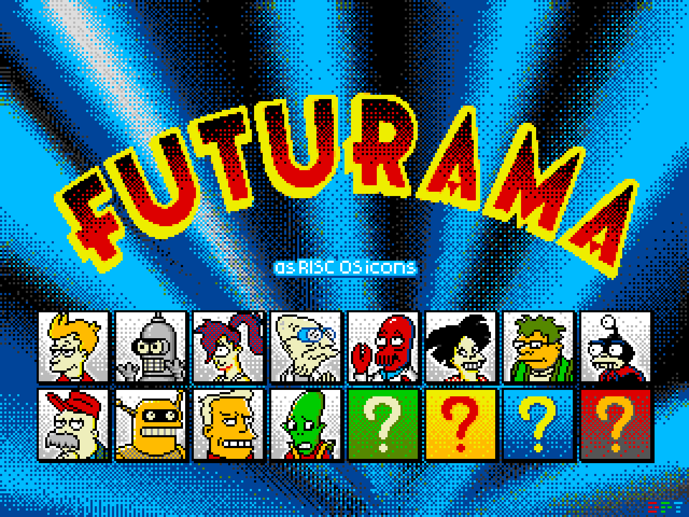

section: Doodles
title: Futurama drawn as RISC OS icons
subtitle: pixel art
icon: pencil-alt
date: 2021-05-30
tags: Doodle, Pixel, Futurama
pageOrder: 1070
----

Here's the main Futurama characters drawn as RISC OS desktop icons.

The palette becomes more restrictive for this group compared to my attempt at [The Simpsons](simpsons-icons.html): I could really do with a light pink shade in the [RISC OS desktop palette](https://lospec.com/palette-list/risc-os) to use for skin. Scruffy looks quite pale for instance. I needed to stipple blue and red to approximate Leela's purple hair.

I made a few recordings of the drawing process. Here's me drawing Leela:

<iframe width="544" height="408" src="https://www.youtube.com/embed/xkGj6NNoIjQ" frameborder="0" allow="accelerometer; autoplay; encrypted-media; gyroscope; picture-in-picture" allowfullscreen></iframe>

Amy:

<iframe width="544" height="408" src="https://www.youtube.com/embed/mAXcJhmlqkc" frameborder="0" allow="accelerometer; autoplay; encrypted-media; gyroscope; picture-in-picture" allowfullscreen></iframe>

and Nibbler:
<iframe width="544" height="408" src="https://www.youtube.com/embed/5Reqyl40rXk" frameborder="0" allow="accelerometer; autoplay; encrypted-media; gyroscope; picture-in-picture" allowfullscreen></iframe>

