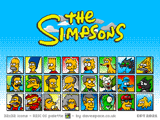
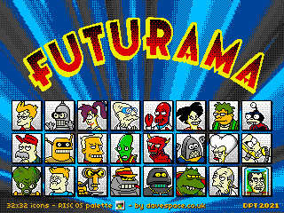
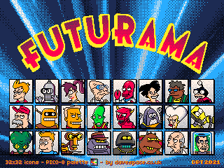
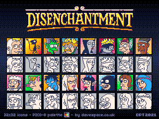

section: Doodles
title: Matt Groening Characters Pixel Art
subtitle: pixel art
icon: pencil-alt
date: 2021-08-07
tags: Doodle, Pixel Art, Groening, Simpsons, Futurama, Disenchantment
pageOrder: 1060
----

These are my recent attempts to draw the characters from Matt Groening's animated TV shows: The Simpsons, Futurama and Disenchantment, as 32x32 desktop icons using [Aseprite](https://www.aseprite.org/).

This presents a challenge since despite the apparent simplicity of the cartoon designs there are often many subtle shapes used which have to be distorted to fit the pixel grid.

I started with the intention of using the 16-colour [RISC OS desktop palette](https://lospec.com/palette-list/risc-os) for all of these, but that became too restrictive and I moved onto using the 16-colour [PICO-8 palette](https://lospec.com/palette-list/pico-8) too.

### The Simpsons

Shown here at 2x native scale.

Thanks to the strong yellow in the RISC OS desktop palette it suits them well. The lack of resolution affects Bart's hair, which as drawn bows out to either side, and prevents some of the more subtle shaping. Some characters' eyes go a bit too square. A Bayer ordered dither is used to create the gradiated backgrounds.

Favourite bit: the 'Duff' logo on Duffman's hat.

### Futurama

Shown here at 2x native scale.

The RISC OS palette became restrictive for this set compared to my attempt at The Simpsons: I could have really done with a light pink shade in the palette to use for skin. Scruffy looks quite pale for instance. I needed to stipple blue and red to approximate Leela's purple hair. With that in mind I had a go at re-colouring and adjusting the drawing to use the PICO-8 palette:

Ahhh, much better.

Favourite bit: Scruffy's eyes.

### Disenchantment

I carried straight on with the PICO-8 palette for my attempts at drawing the characters of Disenchantment:

Shown here at 2x native scale.

In this set I left the outlines in place underneath the original.

Favourite bit: King Zøg.

### Downloads

* [Icons in RISC OS Sprite format (27kB)](icons/groenicons.zip)

