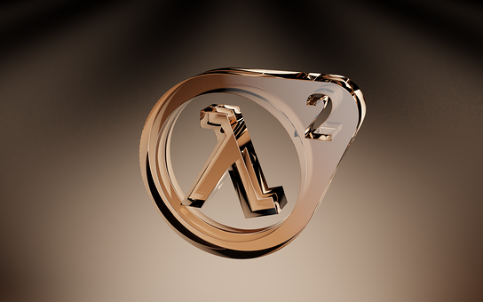
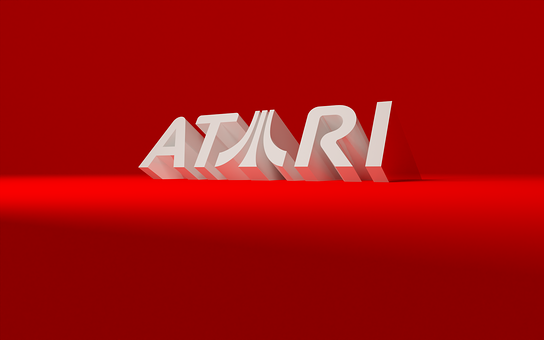
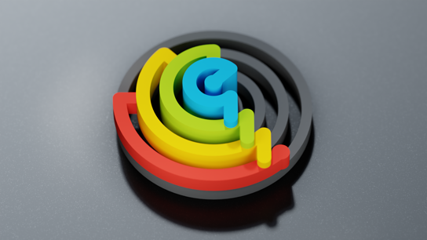

section: Doodles
title: Rendered Logos
subtitle: logos
icon: pencil-alt
date: 2022-07-22
tags: Doodle, 3D, Blender
pageOrder: 1100
----

Logos! Here are some logo themed backdrops (and animations) made in [Blender](https://www.blender.org/).

Click for **huge** 1920x1200 PNG format versions rendered for sRGB colour space. They've all been compressed with ZopfliPNG.

<a>The Half-Life 2 logo, rendered as 3D.</a>

<video src="logos/half-life-2.mp4"></video>
<a>Animated version.</a>

<a>The Planet Express logo from Futurama, rendered as 3D.</a>

<video src="logos/planet-express.mp4"></video>
<a>Older animated version.</a>

<a>The 2002 vintage Atari SA logo, with its fuji lines instead of the middle 'A', rendered as 3D.</a>

<a>A different rendering of the logo I use for my terrible music, rendered as 3D.</a>

## License, Trademarks & Credits

The images are free for personal use. For any commercial use, customisations or commissions please contact me.

The Half-Life 2 logo is a trademark of Valve Corporation.  
The Planet Express logo is an _abandoned_ trademark of Matt Groening (interesting).  
The Atari logo is a trademark of Atari. Inc.

Many of the shaders used are from the [Sanctus Library Addon](https://blendermarket.com/products/sanctus-library-addon---procedural-shaders-collection-for-blender).

## Footnotes

[^1] [my terrible music](https://youtube.com/playlist?list=PLfK7vkQLImGmcc5swQd0QlfSaAK3cMq7M)
