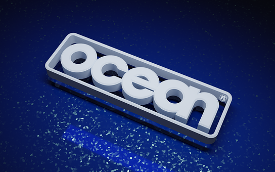
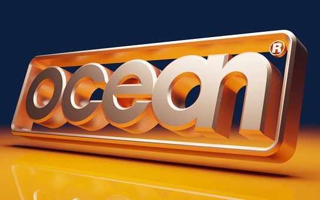
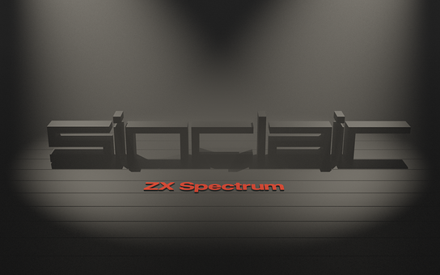
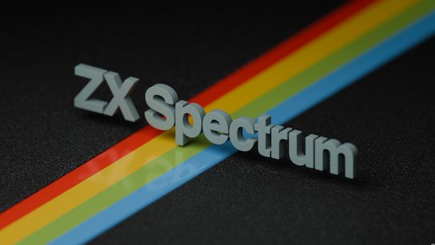

section: Doodles
title: Rendered Logos
subtitle: logos
icon: pencil-alt
date: 2022-07-22
tags: Doodle, 3D, Blender
pageOrder: 1100
----

Here are some logo themed backdrops (and animations) made in [Blender](https://www.blender.org/).

Click for PNG format versions rendered for sRGB colour space. They've all been compressed with ZopfliPNG.

<a>The Half-Life 2 logo, rendered as 3D. (1920x1200)</a>

<video src="logos/half-life-2.mp4"></video>
<a>Animated version.</a>

<a>The Planet Express logo from Futurama, rendered as 3D. (1920x1200)</a>

<video src="logos/planet-express.mp4"></video>
<a>Older animated version.</a>

<iframe width="560" height="315" src="https://www.youtube.com/embed/xupgoFj9qHA" frameborder="0" allow="accelerometer; autoplay; encrypted-media; gyroscope; picture-in-picture" allowfullscreen></iframe>

<a>The 2002 Atari SA logo (featuring the Fuji lines instead of the middle 'A') rendered as 3D. (1920x1200)</a>

<a>A different rendering of the logo I use for my terrible music†, rendered as 3D. (1920x1080)</a>

<a>My first attempt at recreating the Ocean Software logo. There's a definite polo mint feel to it. (1920x1200)</a>

<a>My second attempt at the Ocean logo. Which looks great but is lacking the whole 'sea' theme. (1920x1200)</a>

<a>Sinclair logo recreation - drawing on the 48K+/toastrack style, with a bit of film noir. (1920x1200)</a>

<a>The more rounded Spectrum Next variant of the Sinclair logo. (1920x1200)</a>

<a>ZX Spectrum logo - pulling on the 48K+/toastrack stripes emblem style. (3840x2160)</a>

## License, Trademarks & Credits

The images are free for personal use. For any commercial use, customisations or commissions please contact me.

The Half-Life 2 logo is a trademark of Valve Corporation.  
The Planet Express logo is an _abandoned_ trademark of Matt Groening (interesting).  
The Atari logo is a trademark of Atari. Inc.

Many of the shaders used are from the [Sanctus Library Addon](https://blendermarket.com/products/sanctus-library-addon---procedural-shaders-collection-for-blender).

## Footnotes

† [My terrible music](https://youtube.com/playlist?list=PLfK7vkQLImGk-6VtqTNYR04-oJxgMsK2D&feature=shared).

## Changelog

- 2025-06-28: Added ZX Spectrum render.
- 2024-08-26: Fixed music link.
- 2022-11-19: Added Ocean, Sinclair and Spectrum Next renders.

