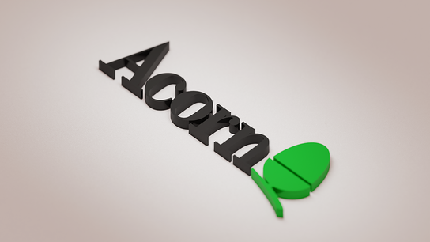
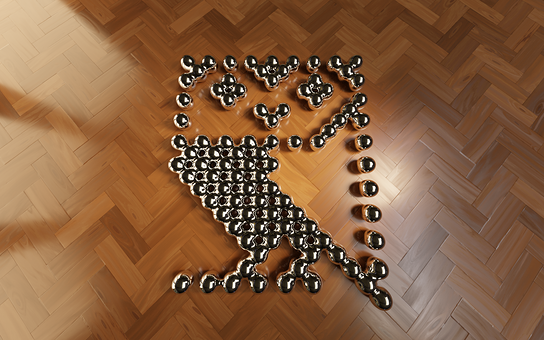
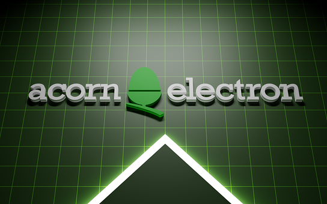
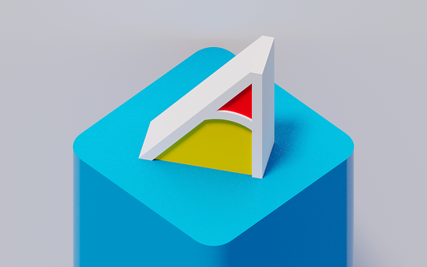
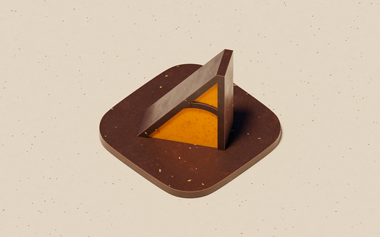
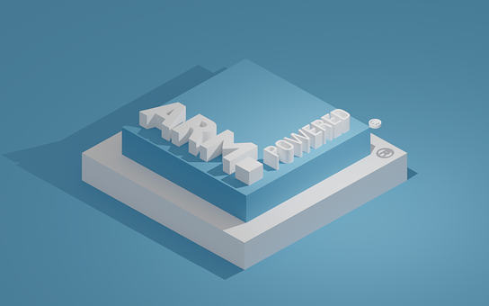
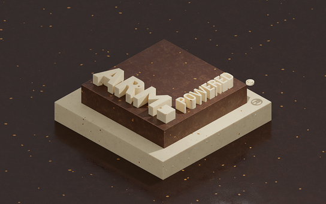
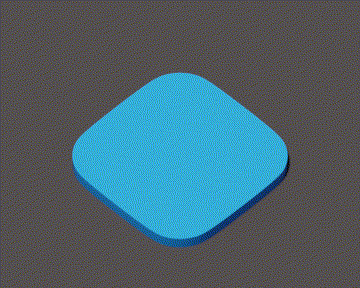
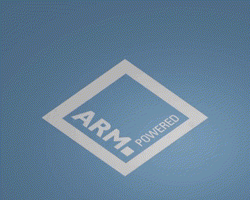

section: Doodles
title: Rendered Nuts
subtitle: backdrops
icon: pencil-alt
date: 2022-07-03
tags: Doodle, 3D, Blender
pageOrder: 1090
----

Nuts! Here are some more Acorn themed backdrops made in [Blender](https://www.blender.org/).

Click for **huge** (in RISC OS terms) 1920x1200 PNG format versions (rendered for sRGB colour space).

<a>The later Acorn logo rendered as 3D.</a>

<a>The BBC Micro Owl logo rendered as 3D.</a>

<a>The Acorn Electron logo rendered as 3D.</a>

<video src="nuts/acorn-electron.mp4"></video>
<a>Animated version.</a>

<a>The Archimedes "A" logo rendered as 3D.</a>

<a>...and transformed into a delicious jaffa cake.</a>

<a>The ARM Powered® logo rendered as 3D.</a>

<a>...and transformed into delicious chocolate cake.</a>

## Animations

<a>Spinning Archimedes "A" logo. Click for an MP4 version.</a>

<a>The ARM Powered® logo rendered as 3D. Click for an MP4 version.</a>

## License, Trademarks & Credits

The images are free for personal use. For any commercial use, customisations or commissions please contact me.

ARM and the ARM Powered logo are property of ARM Ltd.  
As for the others... goodness only knows (I did go looking but gave up).

Many of the shaders used are from the [Sanctus Library Addon](https://blendermarket.com/products/sanctus-library-addon---procedural-shaders-collection-for-blender).
