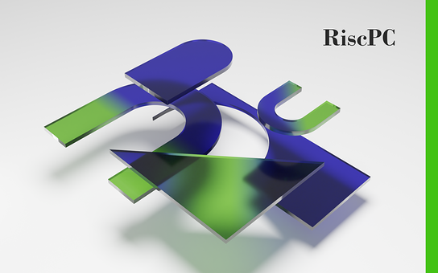

section: Doodles
title: Rendered Nuts
subtitle: backdrops
icon: pencil-alt
date: 2022-07-03
tags: Doodle, 3D, Blender, Acorn, BBC Micro, Electron, Archimedes, ARM, RISC OS
pageOrder: 1090
----

Here are some Acorn themed backdrops and animations made in [Blender](https://www.blender.org/).

Click for **huge** 1920x1200 PNG format versions (rendered for sRGB colour space).

<a>The later Acorn logo, rendered as 3D.</a>

<a>The BBC Micro Owl logo, rendered as 3D.</a>

<a>The Acorn Electron logo, rendered as 3D.</a>

<iframe width="560" height="315" src="https://www.youtube.com/embed/IKlXsoMH-r4" frameborder="0" allow="accelerometer; autoplay; encrypted-media; gyroscope; picture-in-picture" allowfullscreen></iframe>

<a>The Archimedes "A" logo, rendered as 3D.</a>

<a>Spinning Archimedes "A" logo. Click for an MP4 version.</a>

<iframe width="560" height="315" src="https://www.youtube.com/embed/ySv1LxgQsyk" frameborder="0" allow="accelerometer; autoplay; encrypted-media; gyroscope; picture-in-picture" allowfullscreen></iframe>

<a>...and transformed into a delicious jaffa cake.</a>

<a>Another take on the Archimedes logo, rendered as 3D.</a>

<a>RISC OS 3.1 desktop welcome banner.</a>

<a>My recreation of the Risc PC logo.</a>

<iframe width="560" height="315" src="https://www.youtube.com/embed/4Plc8DmweCw" frameborder="0" allow="accelerometer; autoplay; encrypted-media; gyroscope; picture-in-picture" allowfullscreen></iframe>

<a>The ARM Powered® logo, rendered as 3D.</a>

<a>The ARM Powered® logo, rendered as 3D. Click for an MP4 version.</a>

<a>...and transformed into delicious chocolate cake.</a>

## License, Trademarks & Credits

The images are free for personal use. For any commercial use, customisations or commissions please contact me.

ARM and the ARM Powered logo are property of ARM Ltd.  
As for the others... goodness only knows (I did go looking but gave up).

Many of the shaders used are from the [Sanctus Library Addon](https://blendermarket.com/products/sanctus-library-addon---procedural-shaders-collection-for-blender).

## Changelog

- 2024-08-17: Updated YouTube video links.
- 2022-11-19: Added RISC OS 3 welcome banner. Added links to YouTube videos.
- 2022-09-11: Added Risc PC logo recreation.
