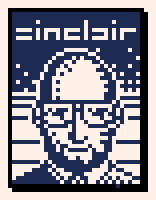

section: Doodles
title: More Pixeling
subtitle: recent pixel art
icon: pencil-alt
date: 2021-11-29
tags: Doodle, Pixel Art
pageOrder: 1070
----

Some pixel art pieces I've worked on recently.

### Weird Science

Inspired by [Weird Science](https://www.imdb.com/title/tt0090305/). Drawn at 320x256 pixels, 16 colours using the [PICO-8 palette](https://lospec.com/palette-list/pico-8) in [Aseprite](https://www.aseprite.org). It took about ten hours, I think.

It's a composite of the main film artwork and the scene where Lisa steps out of the bathroom. For some reason the hardest part was Gary's (on the left) hand.

Timelapse:

CRT style (using https://mattiasgustavsson.itch.io/crtview):

CRT style timelapse:

### Lamborghini

200x100. PICO-8 palette.

### Redhead, Yellow Dress, Sunset

128x128. PICO-8 palette.

### Eight Disco Ladies

178x178. PICO-8 palette.

### Friends & Colleagues

Each head is 32x32. PICO-8 palette.

### Henry Fonta

### Sir Clive, godblessyousir

35x46.

### Logo Ideas

PICO-8 palette.

### Greebling in the Xenon 2 Style

PICO-8 palette.

### Microsoft Mice

RISC OS desktop palette.

