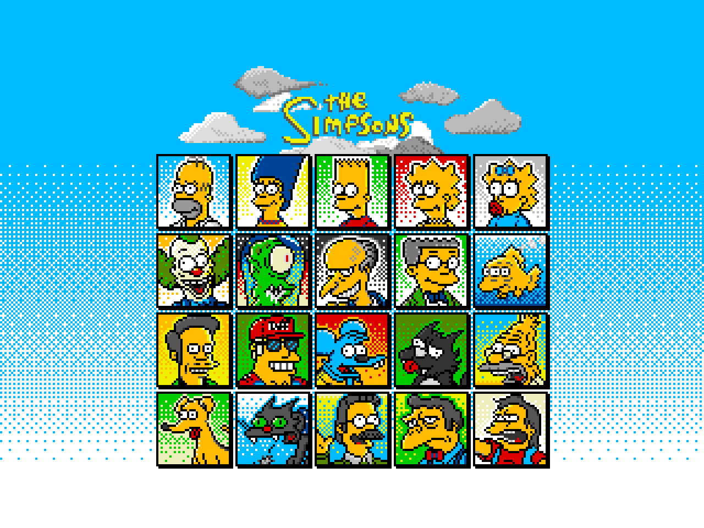

section: Doodles
title: The Simpsons drawn as RISC OS icons
subtitle: pixel art
icon: pencil-alt
date: 2021-05-30
tags: Doodle, Pixel, Simpsons
pageOrder: 1060
----

Here's an attempt to draw the main The Simpsons characters, and a selection of the others, as RISC OS desktop icons.

Thanks to the strong yellow in the [RISC OS desktop palette](https://lospec.com/palette-list/risc-os) it suits them well, in the main. The lack of resolution affects Bart's hair though and prevents some of the more subtle shaping.

I've also attempted [Futurama](futurama-icons.html).
