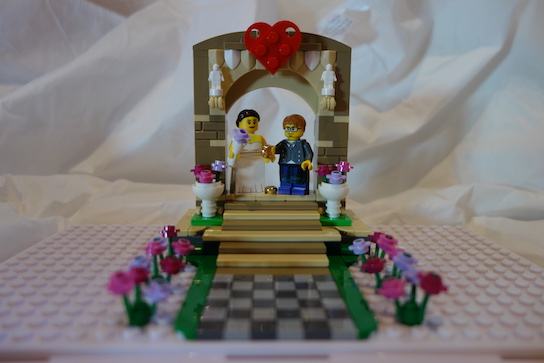
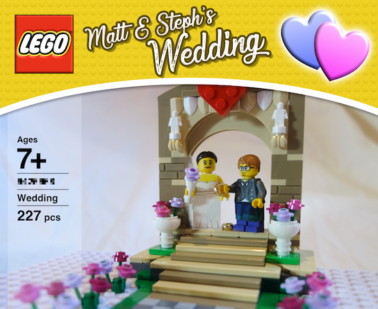

section: Projects
title: A LEGO® Wedding Arch
subtitle: Building a custom LEGO® set.
icon: cheese
date: 2019-09-16
tags: Project, LEGO, Wedding
pageOrder: 1020
----

When our friends, Matt and Steph, got married they requested no wedding gifts. We still thought we ought to get them something properly memorable to mark the occasion. Like all forty-odd year old males I had the idea of building them a custom LEGO wedding arch set.

I started designing the set in [LEGO Digital Designer](https://www.lego.com/en-us/ldd) which has a bit of a learning curve, but isn't too bad. I had to restart the design process over a couple of times when I found that the brick colours I wanted were unavailable (at least in useful quantities).

After various BrickLink orders the LEGO wedding arch set was finished!

[The final building instructions are here.](lego/Building%20Instructions/Building%20Instructions%20[Wedding].html)

The custom minifigures were ordered from [minifigs.me](https://minifigs.me/). Matt needed a ginger mop, a tartan kilt piece and some purple trousers to approximate the purple bootlaces he wore on the day. Steph was harder to match. The initial minifigure faces I chose looked a bit too generic. Eventually I stettled on a turnaround head with a regular smile on one side and a "wry smile" on the other which captures her personality nicely.

I assembled the set in a LEGO-compatible display case obtained via eBay.

In line with ancient law I then disassembled the lot, bagged the parts, printed out the instructions and boxed it up. A cover for the box was required; I cooked up this in Affinity Designer:

Finally I added his n' hers lightsabres.

FIN.

