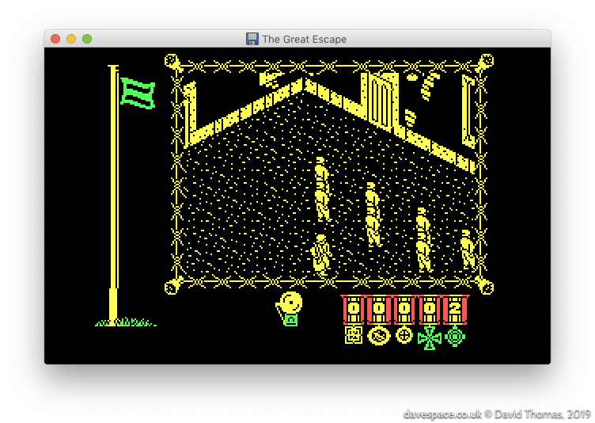
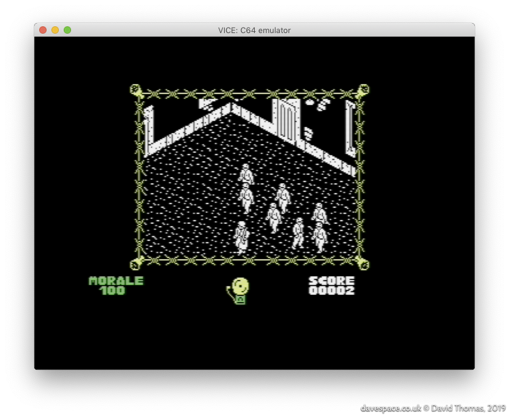
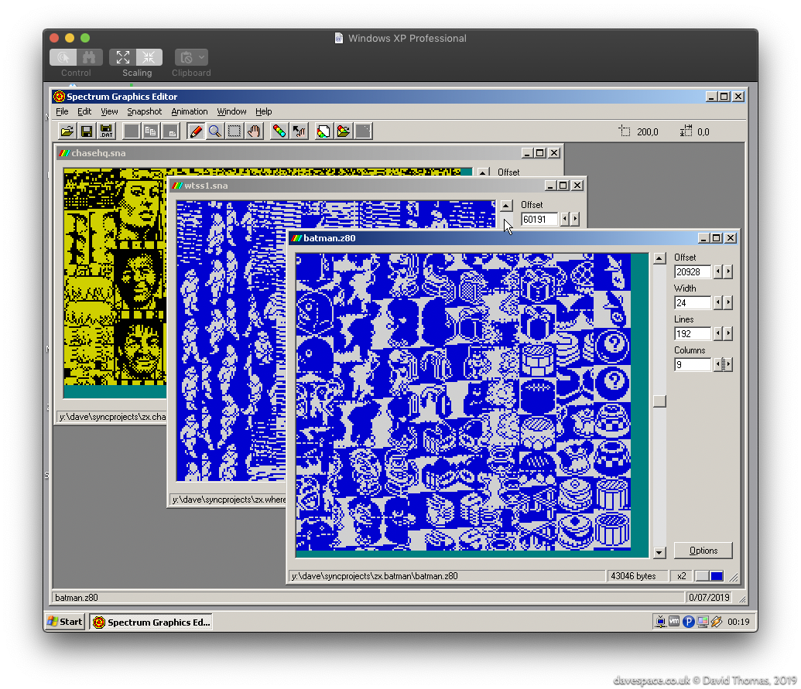
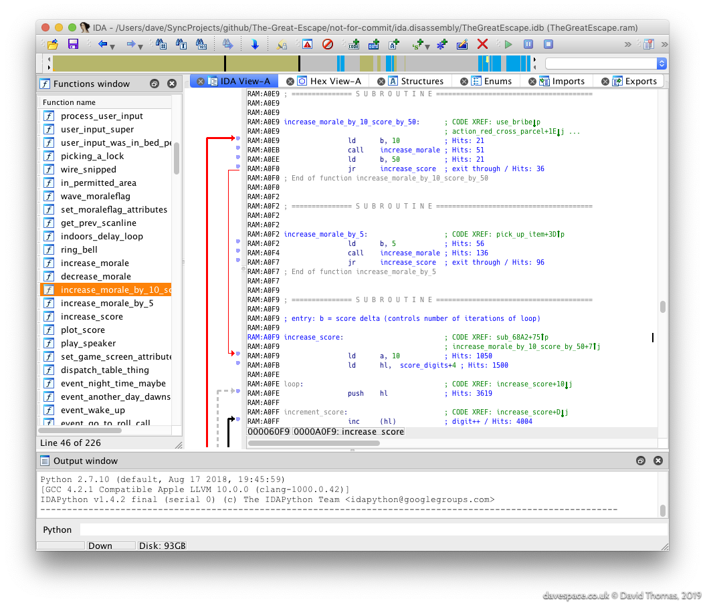

section: Projects
title: Reverse Engineering "The Great Escape"
subtitle: Reverse engineering and rebuilding the classic 48K ZX Spectrum game from 1986.
icon: bell
date: 2019-07-15
tags: GitHub, Project, Game, TheGreatEscape
layout: page
pageOrder: 1020
vim: wrap linebreak textwidth=0 wrapmargin=0 breakindent
----

*The Great Escape* is my project to fully reverse engineer a classic [48K ZX Spectrum](https://en.wikipedia.org/wiki/ZX_Spectrum) game from 1986.

This is an [incomplete] expanded write-up of what I can dimly recall saying while presenting [these slides](http://slides.com/dpt/the-great-escape/#/) to my team at INSIDE Secure (formerly Metaforic, now Verimatrix) in Glasgow in January 2016.

## In Search of Emotion, or: Let's Talk About "Saint's Row: The Third"

2012.

I'd bought [Saints Row: The Third](https://en.wikipedia.org/wiki/Saints_Row:_The_Third) in one of Steam sales and was telling [Nick in work](https://mobile.twitter.com/ngildea85) about how much of a disappointment it was. Despite looking like good fun, it became apparent that the game was driven by revolting characters and basic humour that, while aimed at being an even-more outrageous GTA clone somehow squarely missed the point and just ended up being juvenile garbage. There was no emotion and no characters to care about or empathise with. When presented with the game at the end of the first cutscene I had no inclination to take the controls and continue. I just watched the main characters get shot to bits because I wanted them to die.

Despite Nick's [eyeglaze](http://www.catb.org/jargon/html/M/MEGO.html) I enter into [old man mode](https://www.youtube.com/watch?v=wvwbKfS44Fo) and start recalling the good old days. I tell him about *near pooping my pants* when playing the [Ravenholm](https://www.youtube.com/watch?v=kz71F34UyIM) level of Half Life 2, and then another example - a classic ZX Spectrum game from my childhood - [The Great Escape](http://www.worldofspectrum.org/infoseekid.cgi?id=0002125)! The terror of creeping around the prison yard in the dark, when you're supposed to be in bed, while the bright yellow of the spotlight sweeps around the camp, knowing that at any moment a guard or even the commandant might stumble across you and a chase would begin. You would have to hope that you could outleg the respective captor and hide in a room until the danger had passed by. Now that game had *emotion*. The main character may have been a tiny isometric, monochrome mush of pixels - but I cared about that guy and wanted him free.

I then found myself wondering out loud about how the game worked and thought back to its many mysteries. There was a lot of magic in that game. It never seemed to play the same way twice. The AI seemed to have a life of its own. I never really found out if the radio object could be used; was it a red herring? I wondered how many possible escape methods there were; I only knew of one. Was there any spare space in the game? All these questions.

Those Spectrum games, I agreed with another colleague, were only tiny. *How long could it possibly take to pull it apart?* A two or three **months** maybe?

## The Great Escape - The Game

The Great Escape is a prison break game for the 48K ZX Spectrum. It was released in 1986. You play as *our hero* —an unnamed P.O.W.—trying to escape from a nazi prison camp. It's a 3D isometric, black and white, open world game. The original [reviews](http://www.crashonline.org.uk/35/greatescape.htm) praised it for its tense atmosphere, great graphics and automatic character behaviour. It's one of the best-regarded Spectrum games: as I write this it's joint number one on World of Spectrum's [Visitor Voted Top 100 Best Games list](http://www.worldofspectrum.org/bestgames.html) alongside [R-Type](http://www.worldofspectrum.org/infoseekid.cgi?id=0004256) and [Fairlight](http://www.worldofspectrum.org/infoseekid.cgi?id=0001712).

### The Aim of the Game

The aim of the game is to escape! You achieve this by exploring the map and network of rooms and tunnels, collecting and using objects, biding your time to avoid your captors and finally executing your escape plan.

### Development

The Great Escape was created by [Denton Designs](https://en.wikipedia.org/wiki/Denton_Designs)—based in my home town of Liverpool—who went on to make its follow-up: the mammoth 128K ZX Spectrum-only plane crash survival epic "[Where Time Stood Still](http://www.worldofspectrum.org/infoseek.cgi?regexp=^Where+Time+Stood+Still$&pub=^Ocean+Software+Ltd$&loadpics=1)".

  * [John Heap](https://www.mobygames.com/developer/sheet/view/developerId,15954/) was the designer and programmer
  * [Ally Noble](https://www.mobygames.com/developer/sheet/view/developerId,15975/) was the artist
  * [Bob Wakelin](https://www.mobygames.com/developer/sheet/view/developerId,229501/) created the boxart

I reckon that someone else contributed the title screen music. I base that only on the style of the code.

As with most programs of this age it was written in assembly language. Z80 in this case.

## Specify Sinclair Spectrum Specifications

In case there are any youngsters reading, for a pinch of perspective let's introduce The Greatest Computer Ever Made: the 1982-released ZX Spectrum. It featured:

* An 8-bit Z80A CPU running @ 3.5MHz
* 16K of ROM and 16 or 48K of RAM
* A fixed screen resolution of 256x192, with up to 15 colours
* A built-in 1-bit speaker for music and sound effects

While these specs look unbelievably puny by today's standards, the Speccy was faster and had more RAM than many of its contemporaries, plus it was cheaper.

## Let's Glimpse the Game

We have:

- On the left, a morale flag, which is green by default, but turns red when the hero ventures into places he shouldn't be
  - If the morale sinks down to zero, the player loses control of our hero.
- The main game window
  - This scrolls when the hero is outdoors, but remains fixed when he's indoors.
- The items being carried
  - The hero can carry up to two.
- An alarm bell
  - This rings for timed events like breakfast, or in conjunction with the red morale flag.
- A score
  - The score is perfunctory at best.

[Watch a walkthrough of the game here.](http://www.rzxarchive.co.uk/videos/greatescape.php)

## Ports to Other Platforms

The Great Escape appeared on the ZX Spectrum first, but not exclusively: three other platforms received versions of the game. Curiously they are all direct ports of the Spectrum game code, rather than reimplementations, and the graphics are bitwise identical save for tweaked colours.

This is the DOS version, ported by [Trevor Inns](https://twitter.com/TrevorInns):

The use of CGA mode 4 palette 0 preserves the flag colours, but results in a bit of jaundiced look on the main game screen. CGA mode 4 palette 1 could be used to give a white main game screen but that would turn the other graphics pink and blue.

It also made its way to the Amstrad CPC (port by James Software Ltd.):

 
Note from the score that this version of the game uses a different font (I'm unsure why they changed it).

And, dear lord, the Commodore 64 received a port too (again ported by Trevor Inns):

The DOS version runs just fine, but the Amstrad CPC and Commodore 64 versions really suffer in terms of their speed. The CPC is using a heavier screen mode than the ZX Spectrum, so it ends up shunting more data around, with a theoretically faster 4MHz Z80 CPU, only to produce the same effect. The C64's ~1MHz 6510 is, I presume, why it just can't keep up.

### Recent Ports

mariuszw [ported](https://atariage.com/forums/topic/239167-new-game-great-escape/) the Commodore 64 version of the game to the Atari 8-bit computers. It runs a lot faster than the original Commodore 64 version.

Elysium saw that the Commodore 64 version of The Great Escape was slow and set about tuning it for more speed. The result is a 15% faster version entitled [The Great Escape 115%](https://csdb.dk/release/?id=178037&show=notes). A comparison video is [here](https://www.youtube.com/watch?v=n0Fr2EZzf-4).

## Rippity Doo-Dah: Starting to Pull the Game Apart

So we want to transform a dump of the original game's bytes into a fully-commented assembly language listing. How do we get started?

* First we need to dump the game memory out to an [SNA](http://www.zx-modules.de/fileformats/snaformat.html) format snapshot file. SNA's are uncompressed which makes poking around inside them that bit easier. Aside from a short header we can load them into disassemblers and graphics ripping tools directly and rely on the offsets within the file being valid. In comparison the [Z80](http://www.zx-modules.de/fileformats/z80format.html) snapshot format may use a weak compression scheme which can mangle graphics.

* With the binary snapshot dumped we can load it into a graphics ripper tool and begin to map the game's memory by locating bitmaps, masks, fonts, lookup tables and anything else which doesn't look like code. We'll take a note of these addresses for later.

* We can then run an RZX (a recording of a game) through an emulator which supports profiling. This will capture a list of all addresses executed by the CPU. This gets us a a hit count of every executed instruction - anything not hit is data, or unused bytes.

### Locating Graphics

For The Great Escape, I located the graphics in the game binary by using [the Windows version of SGE](http://retrospec.sgn.net/game/sge) (Spectrum Graphics Editor) by [Richard Jordan](https://twitter.com/EricRetro). (Richard created the Skool Daze tribute/remake called [Klass of '99](http://retrospec.sgn.net/game/ko99) and is now working on an isometric Atic Atac remake called [Melkhior's Mansion](https://retroeric.itch.io/melkhiors-mansion).)

Finding graphics in game binaries is a process of scrolling up and down in an ripping tool like SGE while looking for the "stripes" which give away the presence of graphics data. Since we don't know the width of the graphics we can then try various common widths like 16 or 24 pixels wide. Once the correct width is found the image will snap into focus, albeit possibly offset. None of this is a hard and fast rule however - game authors are free to encode their graphics in whatever form they choose.

Once located, each graphic's offset and dimensions will need to be recorded. However, sometimes it's a bit tricky to decide exactly where the image starts if there is an amount of unused space at the top of an image, which could equally be space allocated to a previous.

### Other Clues

Aside from graphics, what other clues can we find?

#### Strings of Text

We can hunt through the binary for text we recognise. For The Great Escape I knew that it must contain the strings for the input devices we see on the main menu and for the news bulletins that appear at the bottom left of the screen when events happen in the game. However upon inspection I found no ASCII strings in the binary...

When I discovered the font data the reason became apparent: to save space in the game the font omits to keep a separate glyph for letter "O". This saves 8 bytes, but means all text has to be encoded to match the font data. So once decoded it `L00KS LIKE THIS`.

### Other Patterns

Sometimes when scrolling through the graphics we'll see regular patterns of data which we can't resolve into anything recognisable. For instance commonly needed is a table of 256 bit-reversed bytes, which are used for flipping characters left-right. Anything seen in the binary like this could be data, like maps, masks or lookup tables. Anything which looks like random noise is _probably_ instructions. I'll write below about a better way of establishing which locations contain real instructions.

## Commence Disassemblifications

With the binary roughly mapped out we can start disassembling the game.

For my initial disassembly I used [IDA Pro](https://www.hex-rays.com/products/ida/index.shtml). IDA Pro is an interactive disassembler - an eye wateringly expensive one. Although more commonly used these days for reversing malware it can handle many different CPUs including the Spectrum's Z80. Fortunately my (then) employer had a licensed copy that I could use.

IDA is nimble up to a point, but I quickly got annoyed with it repeatedly crashing and not having undo. I wrote an IDAPython script to automate the marking up of the known parts of the executable so I could start from scratch each time it assploded.

### Identifying Instructions

We've now got a semi-opaque binary. We know what _some_ locations contain, but even with IDA Pro's code analysis it's still unclear: which of the remaining locations contains genuine instructions, and which are data? I used the [Free Unix Spectrum Emulator](https://sourceforge.net/projects/fuse-emulator/) (Fuse) with profiling output enabled to see which locations really are instructions. To have a representative run of the game I ran an RZX recording of the game from http://www.rzxarchive.co.uk/ in the emulator to capture the profile. I used a recording of the game being completed. This is important for coverage: we want to make sure that every instruction in the game gets executed.

I captured this profile and pulled it into IDA Pro as comments (look at "Hits: ..." in the screenshot). This took me down routes like:

- Some of the graphics data I identified earlier is getting executed... wtf?
- Aha! Some of the graphics data, once plotted to the screen, isn't ever needed again, so it gets overwritten with a routine.

This is typical for a space-constrained game. Once the graphics are on-screen they're never modified again and don't ever have to be re-plotted, so we can reclaim that valuable space in RAM for buffers. Later on we see that the same is true of anything on the main menu - the title music plays once and is never heard again, for example. Likewise the input handling routines can only be chosen once so are copied into place once chosen, then gets reused as a buffer.

### I/O

Some of the earliest functions to be spotted were those which talk to hardware. These are easy to spot due to the Z80's `IN` and `OUT` mnemonics making it obvious. This includes:

* Keyboard
* Joysticks (Kempston, Sinclair, Protek, Fuller)
* Sound
* Setting the screen border colour

## More to Come in Part 3

~
