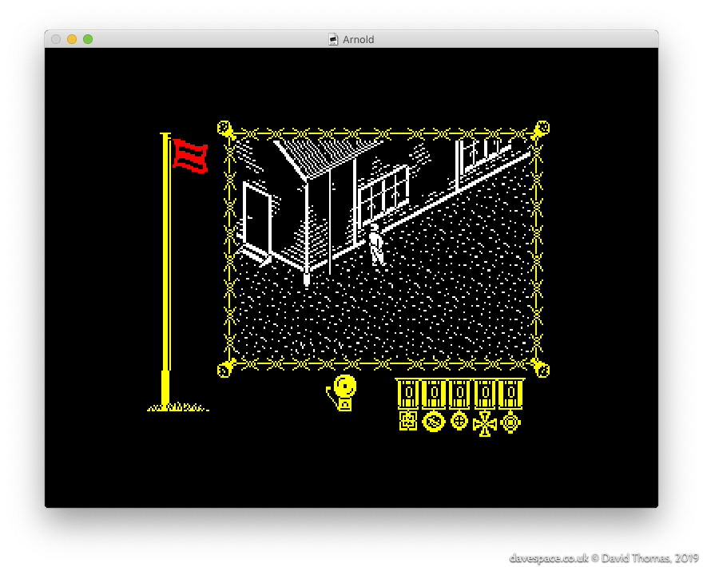
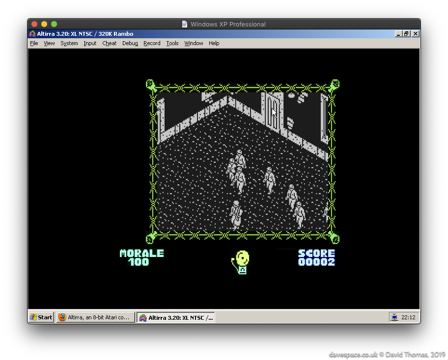

section: Projects
title: Reverse Engineering "The Great Escape"
subtitle: Reverse engineering and rebuilding the classic 48K ZX Spectrum game from 1986.
icon: bell
date: 2019-07-15
tags: GitHub, Project, Game, TheGreatEscape
layout: page
pageOrder: 1020
vim: wrap linebreak textwidth=0 wrapmargin=0 breakindent
----

*The Great Escape* is my project to fully reverse engineer a classic [48K ZX Spectrum](https://en.wikipedia.org/wiki/ZX_Spectrum) game from 1986.

This is an [incomplete] expanded write-up of what I can dimly recall saying while presenting [these slides](http://slides.com/dpt/the-great-escape/#/) to my team at INSIDE Secure (formerly Metaforic, now Verimatrix) in Glasgow in January 2016.

## In Search of Emotion, or: Let's Talk About "Saint's Row: The Third"

2012.

I'd bought [Saints Row: The Third](https://en.wikipedia.org/wiki/Saints_Row:_The_Third) in one of Steam sales and was telling [Nick in work](https://mobile.twitter.com/ngildea85) about how much of a disappointment it was. Despite looking like good fun, it became apparent that the game was driven by revolting characters and basic humour that, while aimed at being an even-more outrageous GTA clone somehow squarely missed the point and just ended up being juvenile garbage. There was no emotion and no characters to care about or empathise with. When presented with the game at the end of the first cutscene I had no inclination to take the controls and continue. I just watched the main characters get shot to bits because I wanted them to die.

Despite Nick's [eyeglaze](http://www.catb.org/jargon/html/M/MEGO.html) I enter into [old man mode](https://www.youtube.com/watch?v=wvwbKfS44Fo) and start recalling the good old days. I tell him about *near pooping my pants* when playing the [Ravenholm](https://www.youtube.com/watch?v=kz71F34UyIM) level of Half Life 2, and then another example - a classic ZX Spectrum game from my childhood - [The Great Escape](http://www.worldofspectrum.org/infoseekid.cgi?id=0002125)! The terror of creeping around the prison yard in the dark, when you're supposed to be in bed, while the bright yellow of the spotlight sweeps around the camp, knowing that at any moment a guard or even the commandant might stumble across you and a chase would begin. You would have to hope that you could outleg the respective captor and hide in a room until the danger had passed by. Now that game had *emotion*. The main character may have been a tiny isometric, monochrome mush of pixels - but I cared about that guy and wanted him free.

I then found myself wondering out loud about how the game worked and thought back to its many mysteries. There was a lot of magic in that game. It never seemed to play the same way twice. The AI seemed to have a life of its own. I never really found out if the radio object could be used; was it a red herring? I wondered how many possible escape methods there were; I only knew of one. Was there any spare space in the game? All these questions.

Those Spectrum games, I agreed with another colleague, were only tiny. *How long could it possibly take to pull it apart?* A two or three **months** maybe?

## The Great Escape - The Game

The Great Escape is a prison break game for the 48K ZX Spectrum. It was released in 1986. You play as *our hero* —an unnamed P.O.W.—trying to escape from a nazi prison camp. It's a 3D isometric, black and white, open world game. At the time the original [reviews](http://www.crashonline.org.uk/35/greatescape.htm) praised it for its tense atmosphere, great graphics and automatic character behaviour.

It's one of the best-regarded Spectrum games: as I write this it's joint number one on World of Spectrum's [Visitor Voted Top 100 Best Games list](http://www.worldofspectrum.org/bestgames.html) alongside [R-Type](http://www.worldofspectrum.org/infoseekid.cgi?id=0004256) and [Fairlight](http://www.worldofspectrum.org/infoseekid.cgi?id=0001712).

### The Aim of the Game

The aim of the game is to escape! You achieve this by exploring the map and network of rooms and tunnels, collecting and using objects, biding your time to avoid your captors and finally executing your escape plan.

### Development

The Great Escape was created by [Denton Designs](https://en.wikipedia.org/wiki/Denton_Designs)—based in my home town of Liverpool—who went on to make its sequel of sorts: the mammoth 128K ZX Spectrum-only plane crash survival epic "[Where Time Stood Still](http://www.worldofspectrum.org/infoseek.cgi?regexp=^Where+Time+Stood+Still$&pub=^Ocean+Software+Ltd$&loadpics=1)".

Credits:

  * [John Heap](https://www.mobygames.com/developer/sheet/view/developerId,15954/) was the designer and programmer
  * [Ally Noble](https://www.mobygames.com/developer/sheet/view/developerId,15975/) was the artist
  * [Bob Wakelin](https://www.mobygames.com/developer/sheet/view/developerId,229501/) created the boxart

(It's my guess that someone else contributed the music, judging by the style of the code).

As with most programs of this age it was written in assembly language. Z80 in this case.

## Specify Sinclair Spectrum Specifications

In case there are any youngsters reading, for a pinch of perspective let's consider The Greatest Computer Ever Made: the 1982-released 48K ZX Spectrum. It featured:

* An 8-bit Z80A CPU running @ 3.5MHz
* 16K of ROM and 48K of RAM
* A fixed screen resolution of 256x192
  * Effectively monochrome, but each 8x8 block can choose two colours from a set of 16
  * Screen memory is in a weird order
* A built-in 1-bit speaker for music and sound effects

While these specs look unbelievably puny by today's standards, the Speccy was faster and had more RAM than many of its contemporaries, plus it was cheaper.

## Let's Look at the Game

We have:

- a morale flag, which is green by default, but turns red when the hero ventures into places he shouldn't be
- a score, which is perfunctory at best, meaningless at worst
- an alarm bell, which rings for timed events like breakfast, or in conjunction with the red morale flag
- up to two items being carried, and
- the main game window

[Watch a walkthrough of the game here.](http://www.rzxarchive.co.uk/videos/greatescape.php)

## Ports

### Contemporary Platform Ports

Three other platforms received versions of The Great Escape. Curiously they are all direct ports of the Spectrum game code, and the graphics are bitwise identical save for tweaked colours.

This is the DOS version, ported by [Trevor Inns](https://twitter.com/TrevorInns):

The use of CGA mode 4 palette 0 preserves the flag colours, but results in a bit of jaundiced look on the main game screen. CGA mode 4 palette 1 could be used to give a white main game screen but that would turn the other graphics pink and blue.

It also made its way to the Amstrad CPC (port by James Software Ltd.):

Note the different font used (I'm unsure why they changed it).

And, dear lord, the Commodore 64 received a port too (again ported by Trevor Inns):

The DOS version runs just fine, but the Amstrad CPC and Commodore 64 versions really suffer in terms of their speed. The CPC is using a heavier screen mode than the Speccy so ends up shunting more data around, with the same CPU as the Speccy, only to produce the same effect (but at 4MHz). The C64's ~1Mhz 6510 is, I presume, why it just can't keep up.

### Recent Ports

mariuszw [ported](https://atariage.com/forums/topic/239167-new-game-great-escape/) the Commodore 64 version of the game to the Atari 8-bit computers. It runs a lot faster than the Commodore 64 version.

(July 2019)

Elysium saw that the Commodore 64 version of The Great Escape was dog slow and set about tuning it for more speed. The result is a 15% faster version entitled [The Great Escape 115%](https://csdb.dk/release/?id=178037&show=notes). A comparison video is [here](https://www.youtube.com/watch?v=n0Fr2EZzf-4).

## More to Come in Part 2

~
