section: RISC OS
title: Replace an Iyonix’s Case
icon: wrench
date: 2013-04-07
tags: RISC OS, Hardware, Iyonix
layout: page
pageOrder: 500
----

*This article was originally printed in the December 2010 (vol. 22 issue 11) of Archive magazine.*

## Ouch

Once again I’d banged my left knee on the [IYONIX pc](http://en.wikipedia.org/wiki/Iyonix_PC) sitting under the desk; I cursed and vowed revenge. The “Panther” case in which it was housed seemed extravagant considering the sparse motherboard lying within. Lacking the bulky CPU heatsinks of a modern PC, the Iyonix motherboard is clear of major lumps and bumps so seems ideal for moving into a smaller, more appropriate, case. Here I’m documenting my experience in doing just that.

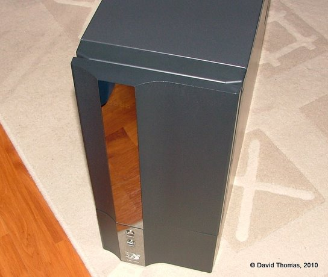

The ‘Panther’ case.

## The New Case

The Iyonix motherboard is a microATX format board so it should slot reasonably easily into any modern ATX form factor case. After a bit of searching for something suitable I chose a [LIAN LI PC-V351A](http://www.lian-li.com/v2/en/product/product06.php?pr_index=317&cl_index=1&sc_index=25&ss_index=64) case. This measures 279mm × 262mm × 373mm. Its all-aluminium construction aids cooling. It features twin 120mm front fans, an 80mm rear fan and sideways mounted drive bays. The front of the case is clean, almost sparse, looking with the power and reset buttons at the bottom right hand side. It’s available in a variety of colours, including black, red and blue. I chose the silver version and ordered it from SVP.co.uk.

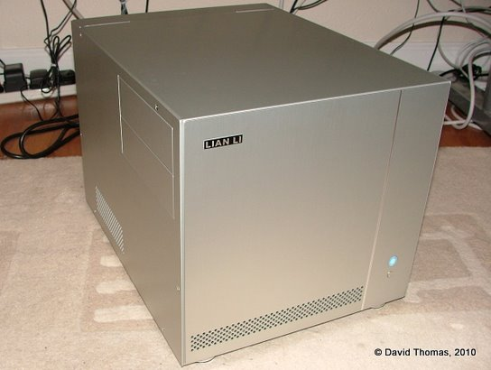

The new LIAN LI case, plus a shiatload of messy wiring under my desk.

The case is not supplied with a PSU. You have the option of buying a new one or transferring the existing one across. Given the extensive problems people seem to have with Iyonix PSUs it might be for the best to use something proven at least until you’re happy that your changed setup is stable.

## Time To Take Some Notes

Before removing any components make a note of how the existing case’s wiring connects to the motherboard. Unlike any common PC motherboard, the Iyonix doesn’t label its connectors. Taking a detailed note before you unplug anything is essential if you want it all to go back together again.

I wish I’d known about riscos.info’s useful [jumpers document](http://www.riscos.info/downloads/documents/IYONIX/IyonixJumpers.pdf) before starting the upgrade, as it helpfully lists all of the connections present on the Iyonix motherboard.

You should also record which slots the PCI cards were located in as the Iyonix may get upset if they move position.

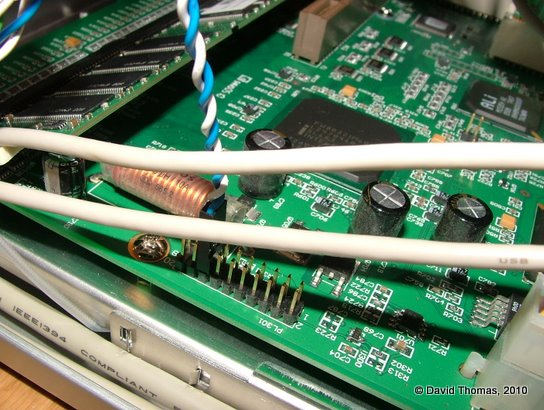

Connecting the reset connector – pins 15 and 16 on PL301 – obviously.

## Disassemble Number Johnny Five

Once notes are taken we can dismantle the existing case, removing the drives, PCI cards, motherboard and PSU - remembering, of course, to observe electro-static precautions. This is usually a good opportunity to clean out any dust which has accumulated on the components.

A tricky part to disassemble is that the motherboard’s rear panel which snaps into its hole in the case. This can be a bit of a pain to remove and re-insert. The trick is to press in at the edges from the rear of the case. They will, with a bit of wiggling, click out of position and allow the motherboard to be fully removed.

## Reassemble Number Johnny Five

The first step is to prepare the new case for the mounting of the motherboard. In the V351 case the motherboard sits on a removable tray which slides out to the rear. Mounting bolts must be screwed into the motherboard tray before the motherboard can be mounted. Screwing the motherboard directly to the tray is very likely to fry it (I mention this as a colleague once did just that to his brand new PC.)

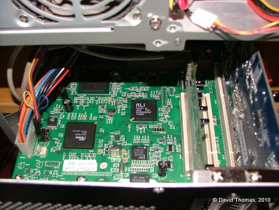

Motherboard and PCI cards mounted on the tray.

Once the bolts are in place, clip the motherboard back into the rear panel. Make sure that the board is steady on its mounts and that the screw holes line up. You can then screw the motherboard into place. Note that the mount adjacent to the rightmost PCI slots is there only for support and doesn’t need a screw. With the motherboard securely in place we can then re-insert the PCI cards back into their original slots and screw them to the rear of the case.

Now we can start connecting the power cables up. First in is the large power connector on the left hand side of the board. Then we can insert the smaller cables at the top of the board: the IDE LED, the front power light, the power switch.

Using small cable ties to keep the wires together can aid the airflow through the case and prevents stray wires from potentially shorting against bits of the board.

Next the reset switch which is connected to the left hand side of the board. This had become bent in my own machine as the original Panther reset lead wasn’t apparently long enough.

Finally the V351 provides a micro speaker which connects to the header next to the last PCI slot. These are intended for producing beeping noises only so don’t expect much quality from it.

## Hard Drivin’

The V351 provides sideways mounted 5.25” drive bays. You can use one side of the case or the other. I picked the right hand side for my CD-ROM drive and floppy as this best fits my desk layout.

I had a purge last year so only own a few floppy discs now. I was prepared to retire the floppy drive and fit a CD-ROM drive and a DVD-ROM drive in the two available bays. However when I booted the Iyonix without a floppy drive installed something as yet unknown would fail at boot and no USB devices would work.So I’ve left it in place for now.

The drives slide into the case on rails. There are screws supplied which match the rails instead of the normal M3 drive screws. An additional thumbscrew is provided to secure each drive.

Since this is a small case, the data and power cables are a little fiddly once the drive is in place so it may be worthwhile to plug them in before slotting the drive into position.

## Jack Me Up

The V351 has a front (well, side) IO port with USB, Firewire and audio connections. It took a bit of time to work out if the case’s connectors for joining up the front connector panel would fit:

* Front USB ports — My Iyonix is fitted with an NEC µPD720100A-based PCI card which provides two rear USB ports and two internal ports (upon closer investigation it turned out to have another spare internal port, too.) After a bit of circuit tracing I confirmed that the case connector matched exactly.  However the connector had a blocked out pin. Should I chop the pin off of the PCI card’s internal connector or drill out the blocked-off pin hole? I settled for the latter.

* Front AC’97 audio — This connector looks like it ought to just join up. It has the same 2×5 block connector. But if you do connect it up the Iyonix loses its voice. It seems that the connectors are wired up differently. For now I’ve decided that I can live without the front audio jacks until I can wire up an adaptor cable.

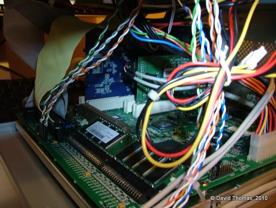

Interior. Blue card at rear is video. Green is USB. Flat floppy and IDE leads are used at this stage.

The case also has HD audio and FireWire connectors which can’t be used with the Iyonix.

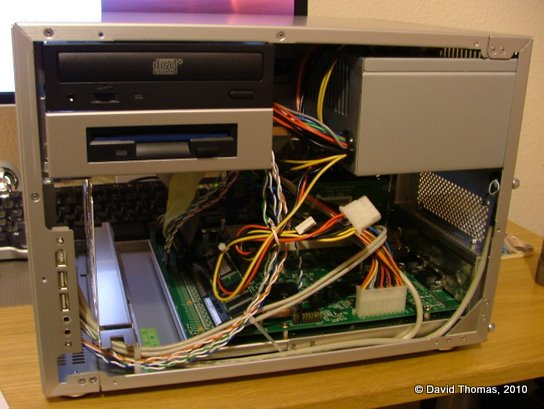

PSU, motherboard, drives, installed.

## Discy Business

The existing hard disc was noisy, so to cut this down I replaced the existing Maxtor 80G 3.5” IDE hard disc with a Samsung 160G 2.5” drive purchased from eBuyer.com.
  
2.5” drives are intended for laptops and use a smaller connector than 3.5” drives. It unifies the data and power signals so is wired differently from its bigger brother. To connect a 2.5” drive to a machine expecting a 3.5” drive you need a small adaptor board. I ordered one from an eBay UK seller.

Additionally the V351 drive bay uses a rail system with space for two stacked drives, where each drive sits on rubber grommets to stop any vibrations from the drive being transmitted through the case. The 2.5” drive’s form factor is too small to fit onto the rails, so I fitted a 2.5” to 3.5” drive mounting bracket kit purchased from an eBay UK seller.  

The rear of the drive bay has an 80mm fan fitted which after a bit of testing turned out to be redundant so was removed.

To prepare the drive I configured it as a slave and connected it up alongside the existing drive, booted, formatted it to its full capacity using HForm and then copied all of my files across.

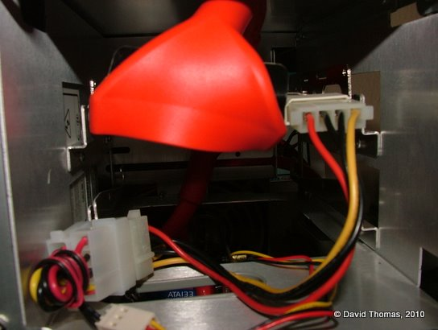

The bay is set up for a pair of 3.5” drives, so the 2.5” drive has a mounting bracket fitted. This doesn’t provide an entirely satisfactory fit.

As you might have predicted the LFAU on the new drive is huge, resulting in a lot of wastage. Do we care about wastage when our drives are this big? I’m not sure. Clares Micro Supplies Ltd. used to sell a utility called BDFS which would partition a single physical drive into multiple logical drives. Splitting the drive up would address the problem. I wonder if its author can be convinced to upgrade it for 32-bit RISC OS 5?

## Video Card Cooling Noise

With the system reassembled and the hard disc noise addressed it became obvious that the biggest remaining source of noise was the video card’s cooling fan emitting a high-pitched whine.

To resolve the “pyjamas” reset problem I’d, a couple of years previously, replaced its original GeForce 2 MX400 card with a GeForce FX5500 model which has a small on-board fan. I had tried replacing the on-board fan with a fanless northbridge heatsink, but it became too hot — even with the front 120mm fans blowing — so a fan mounted on the card is necessary. I replaced the heatsink with a super-quiet fan copper VGA cooler from Quietpc.com. Unlike the stock cooler this can’t be powered from the video card itself, so is instead connected up to a spare power rail from the PSU.

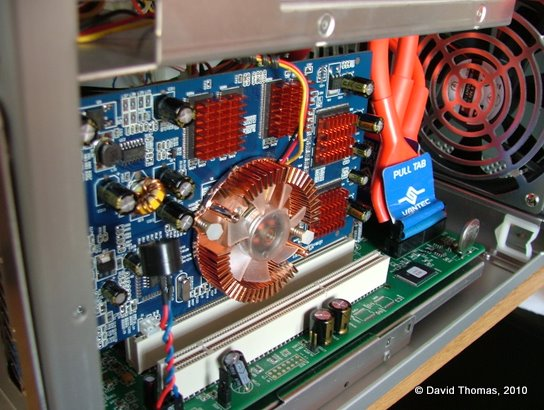

GeForce FX5500 with new copper fan and heatsink mounted on the CPU and individual copper heatsinks mounted on (pairs of) RAM chips. The red/blue twisty thing at the front is a tiny speaker.

The VGA cooler came with copper stick-on mini heatsinks for cooling the card’s RAM, so I applied those at the same time. Some were left over so they were put on the motherboard’s main ICs.

The card is barely audible now.

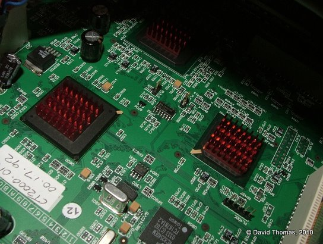

Spare heatsinks were mounted on the three major chips.

## Round Round

The front of the case holds two 120mm fans which circulate air through the case. The left hand fan was partly obscured with the standard IDE and floppy ribbon cables which join the motherboard at that point.

To clear space allowing airflow to be less impeded, we can use rounded cables which contain all of the same connectors but in a stranded cable format which is easier to route.

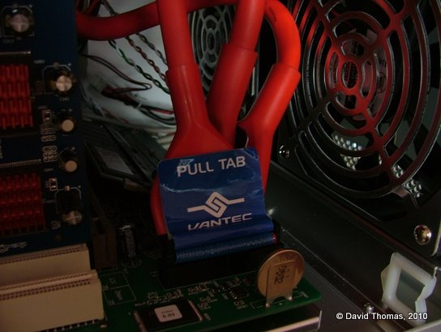

Rounded floppy and IDE leads installed.

I swapped the standard cables for a set of rounded leads, again ordered from eBay UK.

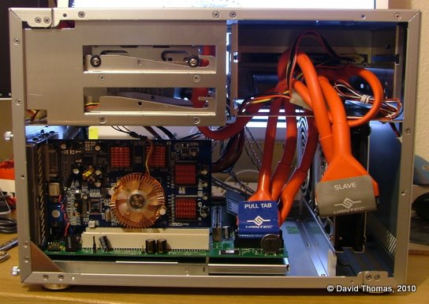

I bought 12” ones but with hindsight these are probably a few inches too long.

## All Together Now

The Iyonix is now small enough to sit atop my other PC and so quiet that I can barely hear it.

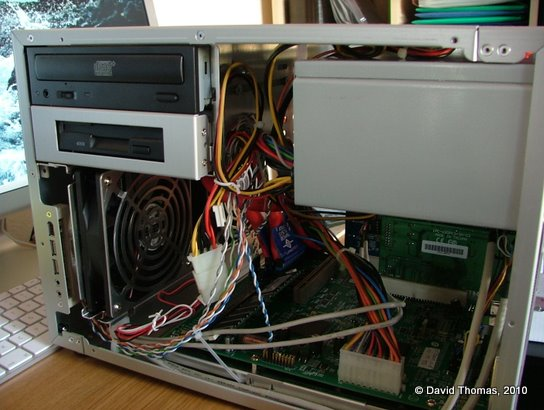

Side view.

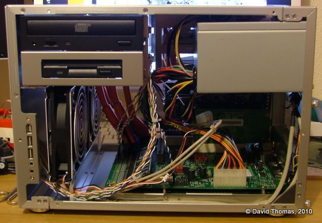

And another.

