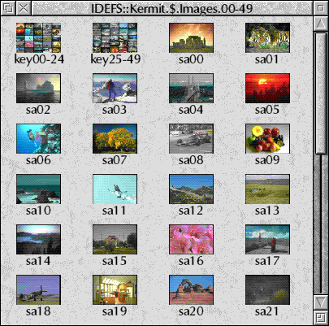
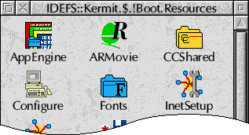
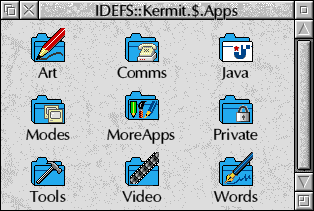

section: RISC OS
title: PhotoFiler
subtitle: Turns the RISC OS Filer into an image thumbnailing tool.
icon: camera
date: 2013-04-07
tags: RISC OS, PhotoFiler
pageOrder: 10
----

## Details

    

PhotoFiler is a utility which extends the display abilities of the RISC OS Filer, turning it into an image thumbnailing tool.

When PhotoFiler is loaded, Sprites, JPEGs and DrawFiles can be shown in miniature in place of their usual file type icon. This is very useful for organising collections of bitmap and clip-art images, as it allows rapid identification of images.

It can also integrate with ImageFS and the ArtWorks renderer modules.

In addition to thumbnailing, it also allows you to define your own directory sprites and remove the pling (‘!’) character from the display of application names.

PhotoFiler requires RISC OS 3.6 or later (RISC OS 3.5 is supported, if the SpriteExtend 0.99 and DrawFile 1.30 modules are available.)

This version is a new release as freeware with the source code included.

## Features

* Generates detailed Sprite, JPEG and DrawFile thumbnails.
* The thumbnailing process fully multitasks.
* Custom sprites can be defined for directories.
* Plings (‘!’) can be removed from the display of application names.
* Works with all screen modes and filing systems.
* Thumbnailing can quickly be suppressed by holding down Ctrl as you open the directory.
* Control panel allows control over which formats are thumbnailed, dithering, etc.
* Compact module written in 100% assembler.
* Fast.

## (Ancient) Screenshots

PhotoFiler is shown here displaying the contents of the JPEG images directory, as supplied with RISC OS 3.5 and later.

Here the “Hide plings” feature is used to remove the ‘!’ character from the start of application names, giving a neater looking display.

An example of a typical directory enhanced with custom directory sprites. Sprites can be defined for each of the four possible states; selected, unselected, open and closed.

## Download

Current version: 2.08 (05-Feb-2008)

* [Download](../software/photofiler208.zip) (71k Zip)
* [Download](../software/photospr.zip) Example directory sprites – RISC OS 3 style (15k Zip)

## Heritage

[Zappo](http://armware.dk/) wrote [FilerPro](http://www.armpit.dk/files/filerpro/) which was a complete replacement for the RISC OS Filer. One of its numerous features was that it allowed image and movie formats to be thumbnailed with an extensible system of modules.

[Gerph](http://www.gerph.org/) wrote JFFilerPro, which used FilerPro’s thumbnailing modules to add thumbnail support to the native Filer. It crashed a lot, but was so nifty that I reimplemented the entire lot from scratch as PhotoFiler.

## Source Code

The PhotoFiler source lives at [svn://svn.riscos.info/photofiler](svn://svn.riscos.info/photofiler).

Use [http://www.riscos.info/websvn/listing.php?repname=photofiler](http://www.riscos.info/websvn/listing.php?repname=photofiler) for the web-based repository viewer.
