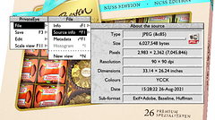

section: RISC OS
title: PrivateEye
subtitle: Image viewer with some editing features.
icon: search
date: 2018-02-08
tags: RISC OS, PrivateEye
pageOrder: 20
----

## Details

    

PrivateEye is an image viewer for RISC OS.

It requires RISC OS 3.6 or later and a Boot sequence with the Nested Wimp and a 32-bit Shared C Library.

## Features

* Loads and displays both bitmap and vector images:
  * Sprites, JPEGs, GIFs and PNGs
  * DrawFiles and ArtWorks
* Bitmap effects:
  * Adjust gamma, brightness and contrast
  * Blur and sharpen
  * Change saturation and apply histogram effects
* Alpha channel support
* Bitmap rotation with interactive preview
  * Rotation is lossless for JPEGs
* Native JPEG display using SpriteExtend’s on-the-fly renderer
* Inbuilt lossless “cleaning” transparently loads progressive JPEGs
* JFIF, Exif and Adobe metadata information
* Multiple-channel histogram
* Display images may be saved:
  * Convert JPEGs, GIFs and PNGs to into Sprites
* Any number of images may be open concurrently
* Customisable key map
* Interactive help (use it!)
  
## Screenshots

[Enlarge](../software/eyesnap5.png)

Improved JPEG format information. (First appeared in version 3.10)

[Enlarge](../software/eyesnap4.png)

[Pixeloo’s untooned Jessica Rabbit](http://pixeloo.blogspot.com/2008/04/jessica-rabbit-untooned.html) demonstrates improved transparency support. (First appeared in version 2.85)

[Enlarge](../software/eyesnap3.png)

Olivia Wilde demonstrates JPEG metadata display. (First appeared in version 2.75)

[Enlarge](../software/eyesnap2.png)

Eva Green demonstrates the effects window. (First appeared in version 2.50)

[Enlarge](../software/eyesnap1.png)

Tigger the cat demonstrates the interactive rotation dialogue. (First appeared in version 2.00)

## Download

Current version: 3.10 (12-Sep-2021)

* [Download](../software/privateeye310-1.zip) (556K Zip)
* [Manual](../software/privateeye310manual.pdf) (1.2M PDF)
* [Screenshot](../software/eyesnap4.png) (332k PNG)

## Source Code

The PrivateEye source lives on github at [https://github.com/dpt/PrivateEye](https://github.com/dpt/PrivateEye).

