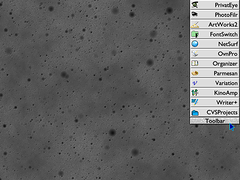

section: RISC OS
title: Toolbar
subtitle: Application launcher.
icon: bolt
date: 2020-08-21
tags: RISC OS, Toolbar
pageOrder: 40
----

## Details

    

Toolbar is a pull-down application launcher. It can also run files and open directories. Once an object is launched, it smoothly retracts back into position.

It can be configured to reside on either on the top left or right-hand side of the screen and stores the names of up to 32 objects.

This version includes an uncrunched `!RunImage`.

## Screenshots

[Toolbar in action](../software/toolsnap1.png)

## Downloads

Current version: 1.22 (21-Aug-2020)

* <download><a href="../software/toolbar122-1.zip">Download</a> (18k Zip)</download>
* <download><a href="../software/toolsnap1.png">Screenshot</a> (258k <acronym>PNG</acronym>)</download>

