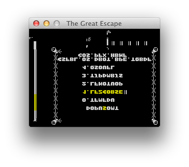

section: The Great Escape
title: C Port
subtitle: Porting the game to C
icon: copyright
date: 2019-07-27
tags: GitHub, Project, Game, The Great Escape
pageOrder: 30
next: legals
previous: discoveries
vim: wrap linebreak textwidth=0 wrapmargin=0 breakindent
----

## No Longer Pseudo Code

By February 2013 I understood the two routines `expand_object` and `plot_indoor_tiles` well enough so my thoughts turned to converting the pseudocode I'd written in the disassembly into some C code.

But first a question: Why target ISO C instead of a higher-level language? Surely something like Python would be more suitable? In fact, my intention with the C port was **not** to create a portable C variant of the game. After all, if implemented accurately, the end result wouldn't be greatly different to playing the game via an emulator - which you can already do. So the C port really exists as proof of my disassembly's accuracy. If any of my understanding of the original game code is wrong then it's likely that the C version would screw up. So in order to move the minimum distance from the original assembly language while preserving the exact structure of the original game, I needed to use a language which can represent every mechanism it contained. That language has to be C.

For example, some leaf functions (functions which call no other) empty the stack and jump directly to the game's main loop. You can't represent that in many HLLs but I _can_ in C by using the nonlocal jump functions `setjmp` and `longjmp`.

Even after choosing C there are numerous ways in which the code has to be _slightly bent_ in order to exist. You can't have C functions with multiple entry points, for instance, nor can you fall off the end of a function into the start of another. Whereever a change like this was required in the C port I labelled it `/* Conv: ... */`.

## Pretend Spectrums

A huge difference in the C version is that I'm no longer coding for a bare metal ZX Spectrum. I needed to build a virtual, or abstract, ZX Spectrum model for it to run on. The hardware we need to simulate includes:

* The screen
* The keyboard
* The speaker

The C version is coded to call out to a support library which provides emulated versions of these.

The original game runs exclusively so wasn't coded to be event driven, or to cooperate with other tasks/processes in any way. For this reason the C port runs the recreated game code in a thread. Although we can run the main game loop for a single iteration and yield to the OS after that, if we don't thread the game then it will fail to yield when it enters code that infinitely loops - which it does when waiting on user input, for instance when defining keys or on the pause screen.

## Bringup

I proceeded with the conversion concurrently with the reverse engineering effort. By January 2016 I had enough parts in place to try to bringup the game.

The first run of the C port did not go to plan:

The second quickly got things the right way around:

And the third got things looking nearly normal:

After this stage it spent a whole lotta time crashing at startup...

## Portability

As intended the C version is highly portable. I've created front ends for macOS:

Windows:

and RISC OS:

 
...admittedly to different levels of completion.

I've also built a version using [emscripten](https://emscripten.org/) which compiles C to JavaScript. [YMMV](http://www.davespace.co.uk/TheGreatEscape/TheGreatEscape.html). Use Kempston otherwise it'll lock up.

## Separation of State

Rather than copying the original game's use of global variables, I encapsulated the game state in its own structure. Since each game is separated this makes it possible to fire up multiple games from the one parent app.

Here's one copy of the macOS port running 20 games at once. (Note: I recorded this forgetting about a rendering hack I had left in place...)

<iframe width="544" height="408" src="https://www.youtube.com/embed/ZYqko6etxFk" frameborder="0" allow="accelerometer; autoplay; encrypted-media; gyroscope; picture-in-picture" allowfullscreen></iframe>

## On Randomness

As shown above, once the C port became suitably capable I was able to fire up multiple copies of the game simultaneously. I'd coded the port to contain its entire state in a structure and pass that into virtually all functions - a typical approach experienced C developers use for robustness and to allow efficient multiple instantiation.

But something odd was going on: two games fired up immediately after one another were **not** behaving the same. The hero would perform the same initial actions - walking to the yard from his bedroom - but then would appear to take different directions when walking. Also in-game events were occurring at different times. Given that I'd captured the game state as a structure and *knew* that I'd reset that structure at the start of the game ... *how* were the two games out of sync? An undefined variable flip-flopping? A rogue memory read? I did quite a bit of static analysis looking for these types of issues and could find no explanation.

After revisiting this repeatedly I finally realised what was happening. It turned out that I was mistaken about the *entire* game state being reset. One of the variables initialised before the menu screen runs is the `game_counter` cyclic counter (which counts 0..140 then repeats). This counter drives the game's events. And while the game waits on the menu screen, that variable is used by the morale flag waving code. When the game starts 'for real' that counter **isn't** reset, but just carries on. So the amount of time spent on the menu screen is effectively a seed which randomises the timing of game events.

This is the case in the original game too: the length of time you spend on the main menu influences how your game plays out.

One piece of magic - explained.
