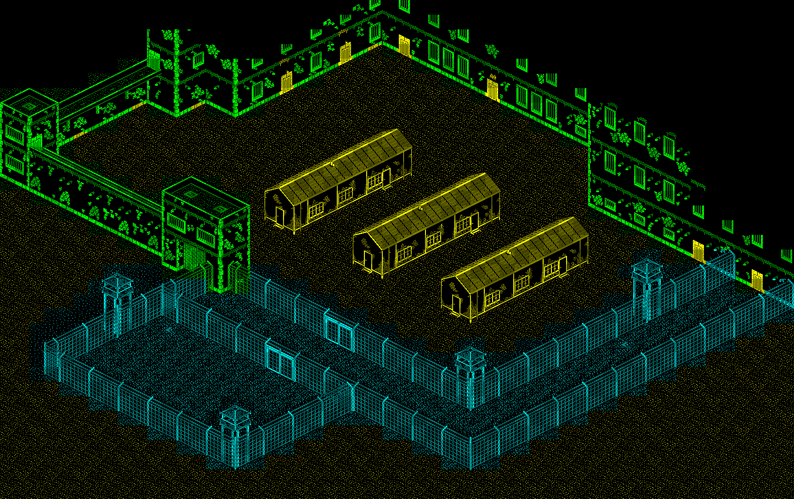

section: The Great Escape
title: Discoveries
subtitle: Things I found out while pulling the game apart
icon: key
date: 2019-07-27
tags: GitHub, Project, Game, The Great Escape
pageOrder: 25
next: c
previous: reversing
vim: wrap linebreak textwidth=0 wrapmargin=0 breakindent
----

## Discoveries & Surprises

So what did I find that was surprising when reversing the game?

### Fuller Joystick Support!

It's in there, but not attached to anything...

### You Can Escape Through the Main Gate!

It was news to me: If you're wearing the guard's uniform and have the papers from the commandant's office, you can 'use' the papers while at the front entrance to be transported outside of the camp.

### There's Nothing Really Higher Up!

The parts of the map you can't normally see are just blank:

### A Double Buffered Screen!

One surprise was to discover that the main game window is double-buffered. This removes flicker and this makes it easier (possible) to build up the screen as well as facilitating smoother scrolling. The buffer is not cheap: it uses 3.3K of RAM.

### There's Only Six Prisoners!

The cast of the game consists of:

* Our Hero
* The Commandant
* Guards 1..15
* Guard dogs 1..4
* Prisoners 1..6

Wait. There's _fifteen_ guards, but only _six_ prisoners? With three huts in the camp, and four beds in each hut, there should be at least double that number, right? True, but the topmost hut contains only sleeping prisoners which never move...

### Objects are People Too!

The _movable items_ in the game - the two stoves and one crate which can be pushed around - are implemented in the game as characters. A bug means you can bribe these objects, at which point they start cycling through broken visuals and wandering around the room...

## The Exterior Map Backdrop

The [game's exterior map backdrop](http://dpt.github.io/The-Great-Escape/Map.html) is stored in an interesting manner. It acts like a huge two-colour monochrome ("bilevel") bitmap, but it's really a cunningly-encoded data structure which utilises redundancy at two levels of detail.

If rendered normally a 1,728 * 1,088 bilevel bitmap like this would occupy 235,008 bytes, but the compression permittted by the redundancy present at both the 8x8 and 32x32 block sizes allows it to compress into just 9,892 bytes.

In fact, the reverse is probably true: small pieces of map were likely drawn and built up into larger sections piecemeal, resulting in an efficiently encoded map.

### Encoding

The main map is a 2D array, 54 by 34, of indices of _super-tiles_ (my terminology). Each index covers a 32x32 pixel area. The Great Escape's map uses 218 unique super-tiles.

Let's examine an area of map near to the front gate (the colouring is mine, $ denotes hex):

The super-tiles are in turn made of 4x4 indices of small tiles. We can zoom in on super-tile $0C, which is part of the hut's roof, to see the indices it uses:

And those indices index the complete set of 571 8x8 map pixel tiles:

But things aren't that simple! Because there are over 256 small tiles these values won't fit in a byte. The map is setup so that there are three groups of super-tiles that each use different ranges of small tiles.

In the diagram above I've used yellow, green and blue to show super-tiles which use different sections of the map tiles. This sliding window approach means that some tiles are known by two different indices, depending on which super-tile accesses it.

### A Map Compressor?

Fascinated by this compression I was interested to see if I could decompress the main map's data into a flat bitmap and recompress it back to the same level.

I built a [map recompressor tool](https://github.com/dpt/The-Great-Escape/tree/master/tools) which analysed the map and attempted to reconstruct it using three different techniques, where various sorting/grouping ideas were tried out. To summarise: no, I couldn't find a method to compress as well as the original game. I have a separate page part-written somewhere which attempts to explain the problem in an appeal to someone more cleverer than I to see if a compressor is possible, or if the 'perfect' compression used in the game is the result of human construction.

## Lumpy Performance

The Great Escape has something of a lax approach to timing. There's no vsync synchronisation etc. The game runs at whatever speed it can manage. You can normally gauge the speed of the game by how fast the morale flag waves up and down.

Having many characters on-screen (e.g. more than 4) will often make the game lag. But even with that in mind sometimes the flag seems too slow.

Analysis of the code reveals that there are two routines which *blit* the back-buffered linear map view onto the Spectrum's main screen. The first is a quick routine which just copies as fast as it can, but the second does a 4-bit roll in order to give the game more scrolling resolution. The trouble is that the first routine is understandably faster than the second.

Once you've spotted this you realise that the slowness is just when the character is on an 'odd' alignment and the slow routine is in use.

## Isometric Projection

The "isometric" projection used in The Great Escape is, like many of its pixel-bound contemporaries, actually a _dimetric_ projection. Isometric means "having equal dimensions" e.g. a trio of 120 degree angles. However the angles used by The Great Escape are approximately 117:117:126 degrees. [^link1] [^link2]

The Great Escape stores an (x,y,z) map position for each character. To place a character or object on-screen we must project its point into isometric 2D. The standard fast method for computing an isometric projected point is:

    x' = x - z
    y' = y + (x + z) / 2

However The Great Escape uses:

    x' = (64 + z - x) * 2
    y' = 256 - x - z - y

(Notation note: 'y' in the game code is 'z' here and 'height' in the game code is 'y' here).

This has the effect of flipping the projected coordinates horizontally and vertically as well as doubling the size of the output and shifting it around a bit. Why is it this way instead of the standard method? I'm not exactly sure but removing the division is a likely explanation. (Well, the map's authored flipped h/z compared to the isometric projected map).

Example: The middle home hut at <94,82..98,98> in the game map becomes <104,80 - 96,76 - 128,60 - 136,64> when projected.

In addition see that in The Great Escape the 'y' (height) value is divided by two. I'm unsure if this is intentional. It means that heights will be 'worth' half as much in terms of movement compared to the standard method.

[^link1]: http://www.cpcwiki.eu/index.php/Isometric_3D
[^link2]: https://en.wikipedia.org/wiki/Isometric_graphics_in_video_games_and_pixel_art
