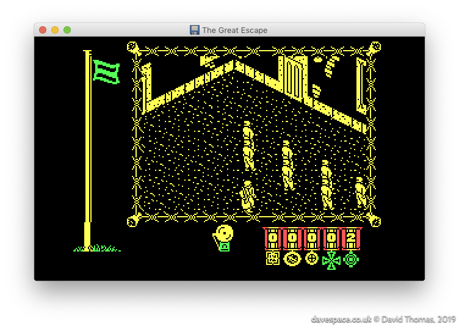
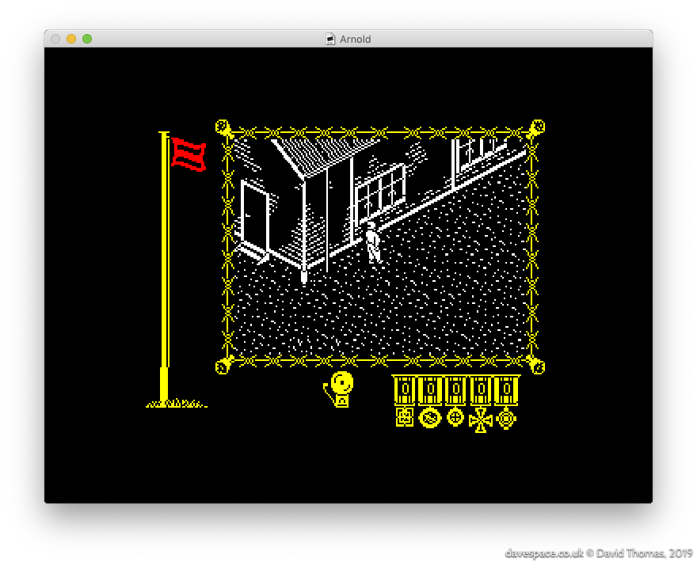
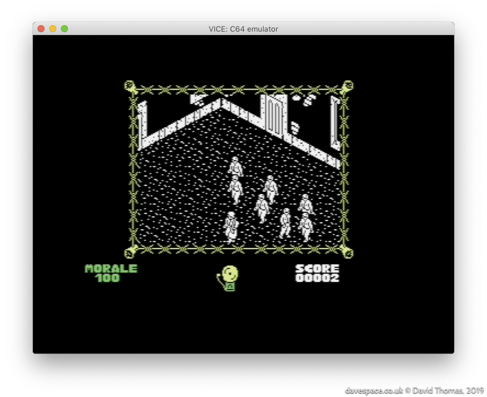
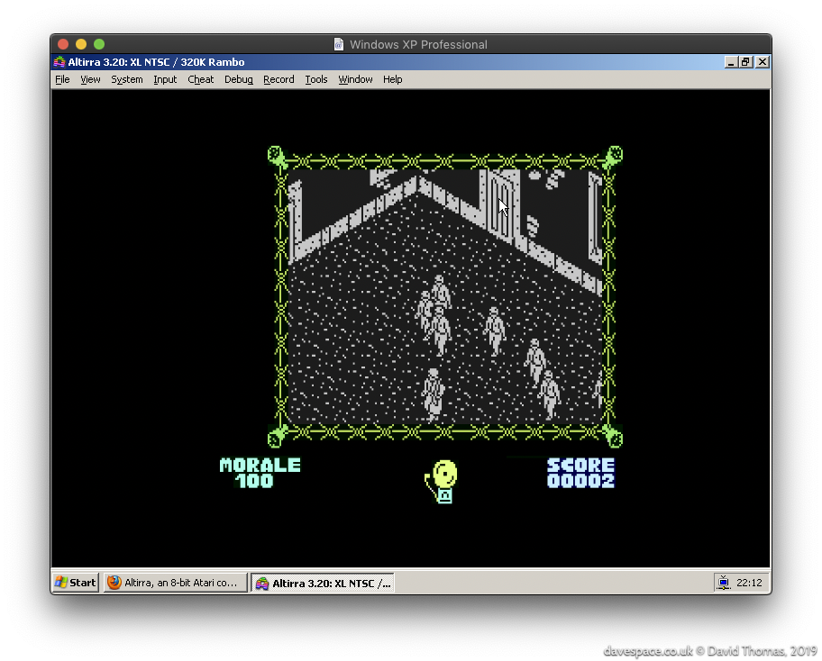

section: The Great Escape
title: Introduction
subtitle: Introducing "The Great Escape"
icon: bell
date: 2019-07-15
tags: GitHub, Project, Game, The Great Escape
pageOrder: 10
next: reversing
previous: index
vim: wrap linebreak textwidth=0 wrapmargin=0 breakindent
----

## In Search of a Game with Some Emotion, or: Let's Talk About "Saint's Row: The Third"

2012: I'd bought [Saints Row: The Third](https://en.wikipedia.org/wiki/Saints_Row:_The_Third) in one of Steam sales and was telling [Nick in work](https://mobile.twitter.com/ngildea85) about how much of a disappointment it was. Despite looking like good fun, it became apparent that the game was driven by empty characters and juvenile humour that, while aimed at being an even-more outrageous GTA clone somehow squarely missed the point and just ended up being pointless garbage. Unlike GTA there was no emotion and no character deserving of empathy. When presented with the game at the end of the first cutscene I had no inclination to take the controls and continue. I just watched the main characters get shot to bits because I wanted them to die.

Despite Nick's [eyeglaze](http://www.catb.org/jargon/html/M/MEGO.html) I enter into [old man mode](https://www.youtube.com/watch?v=wvwbKfS44Fo) and start recalling the good old days. I tell him about *near pooping my pants* when playing the [Ravenholm](https://www.youtube.com/watch?v=kz71F34UyIM) level of Half Life 2, and then another example - a classic ZX Spectrum game from my childhood - [The Great Escape](http://www.worldofspectrum.org/infoseekid.cgi?id=0002125)! Creeping around the prison yard in the dark, when you're supposed to be in bed, while the bright yellow of the spotlight sweeps around the camp, knowing that at any moment a guard or even the commandant might stumble across you and a chase would begin. You would have to outrun the respective captor and hide in a room until the danger had passed by. Now that game had *emotion*. The main character may have been a tiny isometric, monochrome mush of pixels - but I cared about that guy and wanted him free.

I then found myself wondering out loud about how the game worked and thought back to its many mysteries. There was a lot of magic in that game. It never seemed to play the same way twice. The AI seemed to have a life of its own. I never really found out if the radio object could be used; was it a [red herring](https://en.wikipedia.org/wiki/Red_herring)? I wondered how many possible escape methods there were; I only knew of one. Was there any spare space in the game? Did those doorways I could never get to lead to as-yet undiscovered rooms? All these questions.

Those Spectrum games, I agreed with another colleague, were only tiny. *How long could it possibly take to pull it apart?* **Two or three months maybe?**

## The Great Escape - The Game

<a>The Great Escape's original cover artwork.</a>

The Great Escape is a prison break game for the 48K ZX Spectrum. It was released in 1986. You play as an unnamed P.O.W. trying to escape from a wartime nazi prison camp. It's a 3D isometric, black and white, open world game. The original [reviews](http://www.crashonline.org.uk/35/greatescape.htm) praised it for its tense atmosphere, great graphics and automatic character behaviour. It's one of the best-regarded Spectrum games: as I write this it's joint number one on World of Spectrum's [Visitor Voted Top 100 Best Games list](http://www.worldofspectrum.org/bestgames.html) alongside [R-Type](http://www.worldofspectrum.org/infoseekid.cgi?id=0004256) and [Fairlight](http://www.worldofspectrum.org/infoseekid.cgi?id=0001712).

<a>My own copy of the game came from _The Magnificent Seven_ collection, which featured **eight** games...</a>

### The Aim of the Game

The aim is to escape! You achieve this by exploring the map and network of rooms and tunnels, collecting and using objects, biding your time to avoid your captors and finally executing your escape plan.

### Development

The Great Escape was created by [Denton Designs](https://en.wikipedia.org/wiki/Denton_Designs)—based in my home town of Liverpool.

  * [John Heap](https://www.mobygames.com/developer/sheet/view/developerId,15954/) was the designer and programmer
  * [Ally Noble](https://www.mobygames.com/developer/sheet/view/developerId,15975/) was the artist
  * [Bob Wakelin](https://www.mobygames.com/developer/sheet/view/developerId,229501/) created the cover artwork

From inspecting the code I reckon that someone else contributed the title screen music, but I don't know who.

The same team went on to make a follow-up: the mammoth 128K ZX Spectrum-only plane crash survival epic "[Where Time Stood Still](http://www.worldofspectrum.org/infoseek.cgi?regexp=^Where+Time+Stood+Still$&pub=^Ocean+Software+Ltd$&loadpics=1)".

## Specify Sinclair Spectrum Specifications

In case there are any youngsters reading, for a pinch of perspective let's introduce _The Greatest Computer Ever Made_: the 1982-released ZX Spectrum. It featured:

* An 8-bit Z80A CPU running at 3.5MHz
* 16K of ROM and 16- or 48K of RAM
* A fixed screen resolution of 256x192, with up to 15 colours
* A built-in beeper/speaker for music and sound effects
* Cassette tape storage (≈ 1400 baud, taking around five minutes to load a game)

Although I'm being hyperbolic with my "Greatest Computer Ever Made" spiel, and these specs look unbelievably puny by today's standards, the _Speccy_ was clocked faster and had more RAM than many of its contemporaries, while being cheaper.

As with most systems of this generation, games with any sort of performance requirements had to be written in Z80 assembly language.

## Let's Glimpse the Game

Here's a typical game screen:

On the game screen we can see:

- On the left, a flag, which is green by default, but turns red when the hero ventures into off-limits areas
  - The height of the flag shows the hero's current _morale_ level.
  - If his morale sinks down to zero, the player loses control of the hero and the game is forfeit.
- Taking up most of the screen: the main game window
  - This scrolls around the map when the hero is outdoors, but shows a fixed scene when he's indoors.
- Under the screen on the left: the items the hero is carrying
  - The hero can carry up to two items.
- In the centre: an alarm bell
  - This rings for timed events like breakfast, or in conjunction with the red morale flag.
- At the bottom right: the score
  - The score is .. perfunctory at best.

Watch this full walkthrough of the game from [from RZX Archive](http://www.rzxarchive.co.uk/videos/greatescape.php):

<iframe width="544" height="408" src="https://www.youtube.com/embed/YKNzSiiyN8g" frameborder="0" allow="accelerometer; autoplay; encrypted-media; gyroscope; picture-in-picture" allowfullscreen></iframe>

## Ports to Other Platforms

The Great Escape first appeared on the ZX Spectrum, but wasn't platform exclusive: three other platforms received versions of the game. Curiously they are all direct ports of the Spectrum game code rather than reworked versions. The graphics are bitwise identical save for tweaked colours.

This is the DOS version, ported by [Trevor Inns](https://twitter.com/TrevorInns):

The DOS port runs in CGA mode 4 which has a resolution of 320x200 pixels in four colours. The use of palette 0 (black, green, red, yellow) preserves the red and green flag colours, but results in a bit of a jaundiced look on the main game screen. Palette 1 (black, cyan, magenta, white) could have been chosen which would have given a white main game screen, but that would have turned the other graphics pink and blue.

It also made its way to the Amstrad CPC (port by James Software Ltd.):

 
You can see from the from the scoreboard that this version of the game uses a different font (I'm unsure why they changed it).

And, dear lord, the Commodore 64 received a port too (again ported by Trevor Inns):

The DOS version runs just fine on an IBM PC XT class machine, but the Amstrad CPC and Commodore 64 versions are sluggish. The CPC version uses a heavier screen mode than the ZX Spectrum, so it ends up shunting more data around, running slower than the original even though it has a slightly faster 4MHz Z80. The C64's ~1MHz 6510 is, I presume, why it's so slow (though see the sped-up C64 version below).

### Recent Ports

#### Atari 8-bit

In 2015 mariuszw [ported](https://atariage.com/forums/topic/239167-new-game-great-escape/) the Commodore 64 version of the game to the Atari 8-bit computers. He's managed to tune it to run a lot faster than the original Commodore 64 version.

#### Commodore 64

In 2019 demo group Elysium saw that the Commodore 64 version of The Great Escape was slow and set about tuning it for more speed. The result is a 15% faster version entitled [The Great Escape 115%](https://csdb.dk/release/?id=178037&show=notes). A comparison video is [here](https://www.youtube.com/watch?v=n0Fr2EZzf-4).
