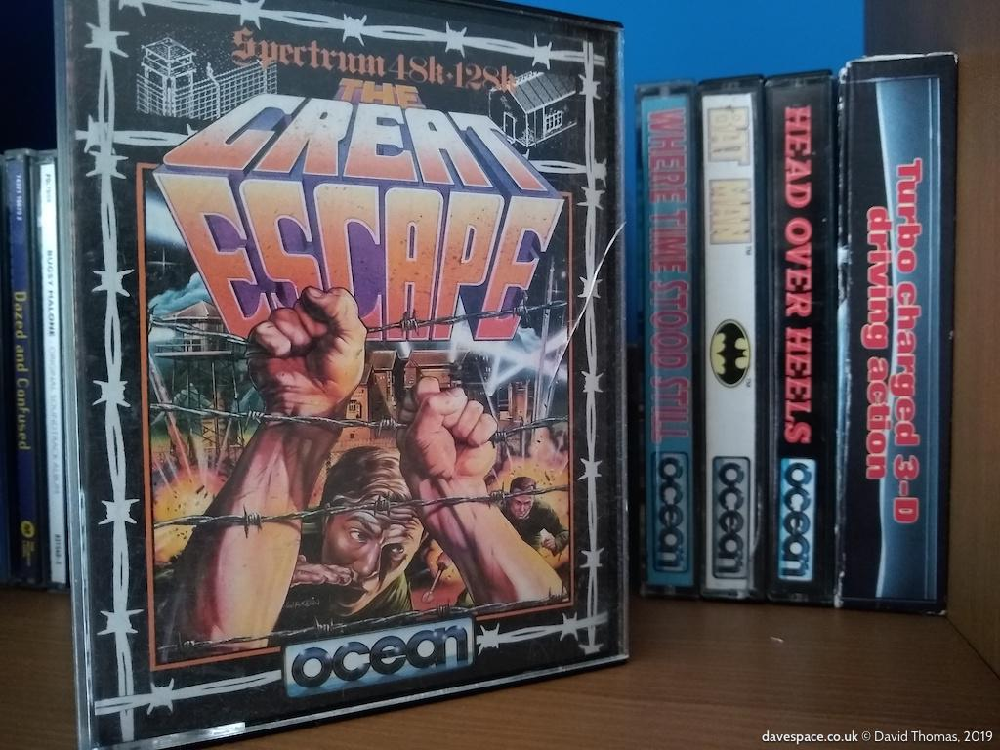

section: The Great Escape
title: Legals
subtitle: Abandonware?
icon: balance-scale
date: 2019-07-27
tags: GitHub, Project, Game, The Great Escape
pageOrder: 100
next: links
previous: c
vim: wrap linebreak textwidth=0 wrapmargin=0 breakindent
----

## Sources

After chugging away at the disassembly for a while I contacted the game's author John Heap looking for permission. I know that some authors don't want their stuff meddled with, but fortunately John was positive.

I had initially resisted bothering him out of respect. Imagine if some lunatic starting disassembling the code you're writing now in 25 years' time, asking detailed questions, pointing out bugs and generally being a pest.

He said the original source is probably in landfill by now :-( and gave me some details about the original 68K dev kit he developed the game on.

## Legals

### Abandonware?

A project such as this can come a cropper at any time due to rights issues. At the point I started this project, and for the bulk of the time during my work, the original game was considered to be _abandonware_. Abandonware is not a legally defined term; we're just talking about software which is no longer profitable enough to be worth pursuing in court should someone start ripping it off. If the cost of hiring lawyers exceeds that of any potential gain from the venture you're looking at making a loss, so why bother?

So sites like http://www.abandonia.com/ can host many abandoned games that aren't worth defending to their rights holders (assuming the rights holders can [even agree who owns it](https://kotaku.com/the-sad-story-behind-a-dead-pc-game-that-cant-come-back-1688358811)).

But if someone decides that acquiring a bunch of old retro games might be profitable they might suddenly un-abandon the game at which point they might start issuing threats to people infringing on their newly-acquired rights.

April 2018: The DOS version of The Great Escape is now [sold on Steam](https://store.steampowered.com/app/814570/The_Great_Escape/) as part of an Ocean bundle.

### Ownership & Rights

The age of the game is a further complicating factor. It was created by Denton Designs and published by Ocean. Let's imagine that the publisher's rights extend for 25 years. Ocean was acquired by Infogrames in 1996 becoming their UK division: Infogrames United Kingdom Ltd. That entity became Atari United Kingdom Ltd in 2003. Then got sold to Namco Bandai Games in 2009 where they are now Bandai Namco Entertainment UK Limited. But do they still own the rights? Now imagine that my supposed 25-year rights have passed, it's possible that the rights reverted to Rage Ltd (which is Denton's successor) but then that went kaput in 2003...

### In Summary

I'm on thin ground distributing any original game assets, so I try to avoid that and provide tools which _operate upon_ original assets. You should definitely buy your own copy of the game. Here's mine :-)

