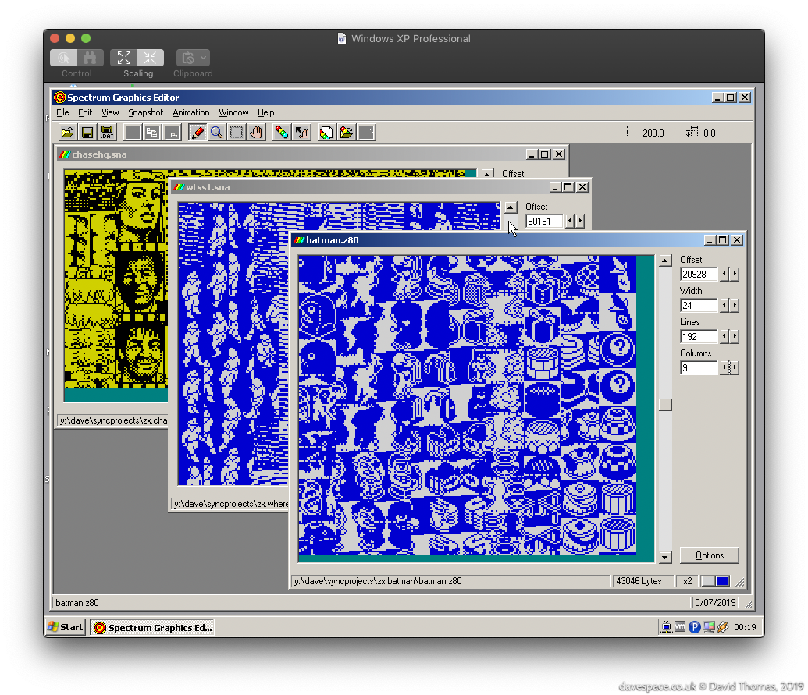
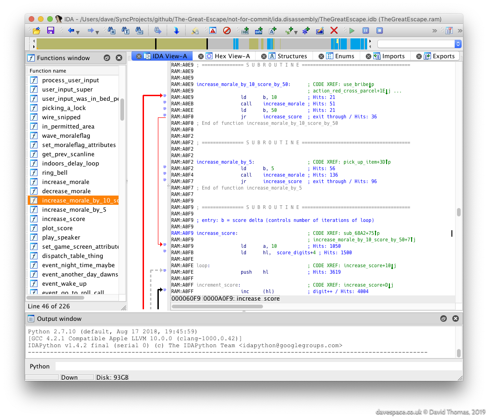

section: The Great Escape
title: Reverse Engineering
subtitle: Disassembling and rebuilding the classic 48K ZX Spectrum game from 1986
icon: dna
date: 2019-07-15
tags: GitHub, Project, Game, The Great Escape
pageOrder: 20
next: discoveries
previous: intro
vim: wrap linebreak textwidth=0 wrapmargin=0 breakindent
----

## Rippity Doo-Dah: Starting to Pull the Game Apart

Ideally we want to transform a dump of the original game's memory into a fully-commented assembly language listing that we can use to rebuild the game. First, is that even possible? Fortunately The Great Escape is self-contained: the game loads everything it needs then runs. If it was a multi-load game, where individual levels need to load from tape, or a 128K-only game, which uses bank switching to get around the Z80's 64K address space limit, then things would be considerably more difficult.

How do we get started?

* First we need to dump the game memory out to an [SNA](http://www.zx-modules.de/fileformats/snaformat.html) format snapshot file. SNA's are uncompressed which makes poking around inside them that bit easier. Aside from a short header we can load them into disassemblers and graphics ripping tools directly and rely on the offsets within the file being valid. In comparison [Z80](http://www.zx-modules.de/fileformats/z80format.html) format snapshots may use a weak compression scheme which can mangle graphics.

* With the binary snapshot dumped we can load it into a graphics ripper tool and begin to map the game's memory by locating bitmaps, masks, fonts, lookup tables and anything else which doesn't look like code. We'll take a note of these addresses for later.

* We can then run an RZX (a recording of a game) through an emulator which supports profiling. This will capture a list of all addresses executed by the CPU. This gets us a a hit count of every executed instruction - anything not hit is data, or unused bytes.

### Locating Graphics

For The Great Escape, I located the graphics in the game binary by using [the Windows version of SGE](http://retrospec.sgn.net/game/sge) (Spectrum Graphics Editor) by [Richard Jordan](https://twitter.com/EricRetro). (Richard created the Skool Daze tribute/remake called [Klass of '99](http://retrospec.sgn.net/game/ko99) and is now working on an isometric Atic Atac remake called [Melkhior's Mansion](https://retroeric.itch.io/melkhiors-mansion).)

Finding graphics in game binaries is a process of scrolling up and down in an ripping tool like SGE while looking for the "stripes" which give away the presence of graphics data. Since we don't know the width of the graphics we can then try various common widths like 16 or 24 pixels wide. Once the correct width is found the image will snap into focus, albeit possibly offset. None of this is a hard and fast rule however - game authors are free to encode their graphics in whatever form they choose.

Once located, each graphic's offset and dimensions will need to be recorded. Sometimes it's a little difficult to decide exactly where the image starts and ends if there is an amount of unused space at the top or bottom of an image, which could equally be space allocated to an adjacent graphic.

### Other Clues

Aside from the graphics, what other clues can we find?

#### Strings of Text

We can hunt through the binary for text we recognise. For The Great Escape I knew that it must contain the strings for the input devices (KEYBOARD, KEMPSTON, SINCLAIR, ...) we see on the main menu. Also the news bulletins that appear at the bottom left of the screen when events happen in the game. However upon inspection I could find no ASCII strings in the binary...

When I located the font data the reason for this became apparent: to save space the font omits the glyph for letter "O" and re-uses the glyph for zero. This saves 8 bytes, but means that all text has to be encoded to match the font data. So "KEYBOARD" is $14,$0E,$21,$0B,$00,$0A,$1A,$0D (where $ denotes hex). Once decoded to ASCII it looks like `KEYB0ARD`.

### Other Patterns

Sometimes when scrolling through the graphics we'll see regular patterns of data which we can't resolve into any recognisable graphic. For instance, commonly needed is a table of 256 bit-reversed bytes, which are used for flipping characters left-right. This can be spotted when dumping graphics. Anything seen in the binary like this could be data, like maps, masks or lookup tables. Anything which looks like random noise is _probably_ going to be instructions. I'll write below about a better way of establishing which locations contain real instructions.

## Commence Disassemblifications

With the binary roughly mapped out we can start disassembling the game's instructions.

For my initial disassembly I used [IDA Pro](https://www.hex-rays.com/products/ida/index.shtml). IDA Pro is an interactive disassembler - an eye wateringly expensive one. Although more commonly used these days for reversing malware it can handle many different CPUs including the Spectrum's Z80. Fortunately my (then) employer had a licensed copy that I could use.

IDA can be nimble up to a point, but I quickly got annoyed with it repeatedly crashing and not having undo. I wrote an IDAPython script to automate the marking up of the known parts of the executable so I could start from scratch each time it assploded.

### Identifying Instructions

We've now got a semi-opaque binary. We know what _some_ locations contain, but even with IDA Pro's code analysis it's still unclear: which of the remaining locations contains genuine instructions, and which are data? I used the [Free Unix Spectrum Emulator](https://sourceforge.net/projects/fuse-emulator/) (FUSE) with profiling output enabled to see which locations really are instructions. To have a representative run of the game I ran an RZX recording of the game from http://www.rzxarchive.co.uk/ in the emulator to capture the profile. The RZX recording ran the game all the way to completion. This is important for coverage: we want to make sure that every instruction in the game gets executed.

I captured this profile and pulled it into IDA Pro as comments (look at the "Hits: ..." comments in the screenshot). This took me down routes like:

- Some of the graphics data I identified earlier is getting executed... wtf?
- Aha! Some of the graphics data, once plotted to the screen, isn't ever needed again, so it gets overwritten with a joystick input handling routine.

This is typical for a space-constrained game. Once the graphics are on-screen they're never modified again and don't ever have to be re-plotted, so we can reclaim that valuable space in RAM for buffers. Later on we see that the same is true of anything on the main menu - the title music plays once and is never heard again, for example, so its space becomes one of the various rendering buffers. Likewise the input handling routines can only be chosen once so are copied into place once chosen, then gets reused as a buffer.

### I/O

Some of the earliest functions I spotted were those which talk to hardware. These are easy to spot due to the Z80's `IN` and `OUT` mnemonics making it obvious. This includes:

* Keyboard input
* Joystick input (Kempston, Sinclair, Protek, Fuller)
* Sound output
* Setting the screen border colour

## Discovering SkoolKit

By this point IDA Pro was **really** starting to grate. I started looking for an alternative Z80 diassembler and discovered that the guy who reverse engineered the Spectrum classics [Skool Daze](https://en.wikipedia.org/wiki/Skool_Daze), [Back to Skool](https://en.wikipedia.org/wiki/Back_to_Skool) and [Contact Sam Cruise](https://en.wikipedia.org/wiki/Contact_Sam_Cruise) (and rewrote them in Python) had built a toolkit called _SkoolKit_ to assist in pulling apart and documenting these games.

SkoolKit is a meta-assembler of sorts. You build your disassembly in a Z80 assembly listing-like file called a `.skool` file. This can then be transformed into either a listing for assembly into a working game, or into a cross-referenced HTML format disassembly.

We can also supplement the disassembly with Python scripts to decode data structures from a snapshot of the game's RAM. We can use this to generate images of game maps, sprites, rooms, and decode other data like the routes the characters take.

I immediately switched allegiance.

### The Great Escape & Skool Daze

There is much in common between Skool Daze and The Great Escape. Both feature an open world with free roaming, automatic characters with "AI" and take a sequence of steps to complete the game.

### SkoolKit's .ctls, .skools & .sfts

SkoolKit offers three formats (though since version 7.2 one format is now deprecated).

The `.ctl` is a *control* file which is a way to annotate addresses, but not include any of the original game data (important if you want to avoid redistributing copyrighted data...)

The `.skool` file is the full-fat version which includes everything necessary to rebuild asm files and HTML disassemblies.

The third option is a `.sft` file which is a Skool File Template. These are deprecated now that .ctls can do just about everything .sfts can do - which wasn't always the case.

[The SkoolKit workflow](https://skoolkit.ca/docs/skoolkit/diy.html) is to start with a .ctl file, and start annotating addresses as each memory location's purpose is decoded. Past some threshold the idea is that the ctl becomes awkward and you move onto using a skool file full-time. I struggled with that and tried to stick with .ctl files for ages.

### Pseudocode

Knowing that I wanted to create a portable C language version of the game I decided to not write plain English comments on the assembly but to instead use a C-styled pseudocode.

This was valuable up to a point, but caused problems when SkoolKit's use of braces conflicted with C's. I ended up bending the notation and it became quite awkward. In the previous year I have rewritten the entire disassembly in plain English.

## Reversing

With Skoolkit setup, from here on the job is mainly to slog away, pulling each function apart and decoding the game's data formats.

When stuck on something we can open up FUSE and (attempt to) use its [debugger](http://manpages.ubuntu.com/manpages/precise/man1/fuse.1.html), or sometimes just poke values into game snapshots to see what happens.

It's a scatty approach: discoveries in one function can impact elsewhere in the code. That in turn can impact elsewhere. You can end up hopping around the disassembly making notes but risk ending up with a giant set of diffs with little cohesion - a hairball patch - then having to spend time splitting the patch up into meaningful commits.

### Complications

Function boundaries aren't always clear in this type of code. Some functions have multiple entry points. Some fall through into the following function. Some have a function buried in their middle. In one case a routine had its `RET` return instruction missing so (harmlessly) fell into another. Even late on in the process I was changing my mind about what constituted a routine.

The game uses some self-modifying code which is a pain in the bum, but often worse was trying to follow register use across code which switches between the Z80's two register banks.

## Now Rewrite it All...

By January 2016 the diassembly was sufficient to reassemble the original game. This was useful for making experimental tweaks to the original game, but the disassembly commentary really wasn't up to scratch. My original choice to write it in a C-style pseudocode proved to be awkward. In 2018 I embarked on a rewrite of every single function in the disassembly. It took about a year to rewrite it all in plain English prose.

